# CampusBrain — Diagrams

Every diagram from [`DOCUMENTATION.md`](DOCUMENTATION.md) in one place, in the order they appear there. Each one is labeled with the section it illustrates — go to that section in `DOCUMENTATION.md` for the surrounding explanation; this file is just the pictures.

## Contents

1. [Project Introduction › Target users](#1-project-introduction-target-users)
2. [Problem Statement › Current workflow](#2-problem-statement-current-workflow)
3. [Problem Statement › Why current systems fail](#3-problem-statement-why-current-systems-fail)
4. [Solution Overview › How a user interacts with the application](#4-solution-overview-how-a-user-interacts-with-the-application)
5. [Solution Overview › The complete workflow, upload to answer › Journey A — Ingestion (happens once per document, in the background)](#5-solution-overview-the-complete-workflow-upload-to-answer-journey-a-ingestion-happens-once-per-document-in-the-background)
6. [Solution Overview › The complete workflow, upload to answer › Journey B — Answering (happens every time someone asks)](#6-solution-overview-the-complete-workflow-upload-to-answer-journey-b-answering-happens-every-time-someone-asks)
7. [System Architecture › The big picture](#7-system-architecture-the-big-picture)
8. [System Architecture › The layered architecture inside the backend](#8-system-architecture-the-layered-architecture-inside-the-backend)
9. [System Architecture › The layered architecture inside the backend (2)](#9-system-architecture-the-layered-architecture-inside-the-backend-2)
10. [System Architecture › Multi-tenancy — keeping colleges separate](#10-system-architecture-multi-tenancy-keeping-colleges-separate)
11. [Folder Structure › How a request flows between folders](#11-folder-structure-how-a-request-flows-between-folders)
12. [Complete Backend Pipeline › 7.1 Ingestion — step by step](#12-complete-backend-pipeline-71-ingestion-step-by-step)
13. [Complete Backend Pipeline › 7.2 Answering — step by step](#13-complete-backend-pipeline-72-answering-step-by-step)
14. [Frontend Pipeline › Screens](#14-frontend-pipeline-screens)
15. [Frontend Pipeline › The authentication hook](#15-frontend-pipeline-the-authentication-hook)
16. [Database Design › The complete schema](#16-database-design-the-complete-schema)
17. [Database Design › Table by table › documents](#17-database-design-table-by-table-documents)
18. [Authentication & Authorization › How login works](#18-authentication-authorization-how-login-works)
19. [Authentication & Authorization › What a JWT is](#19-authentication-authorization-what-a-jwt-is)
20. [Authentication & Authorization › Tenant isolation](#20-authentication-authorization-tenant-isolation)
21. [Document Processing Pipeline › The routing decision](#21-document-processing-pipeline-the-routing-decision)
22. [Document Processing Pipeline › How OCR actually works](#22-document-processing-pipeline-how-ocr-actually-works)
23. [Document Processing Pipeline › Chunking](#23-document-processing-pipeline-chunking)
24. [Retrieval Pipeline › Three search strategies](#24-retrieval-pipeline-three-search-strategies)
25. [LLM Pipeline › Anatomy of the prompt](#25-llm-pipeline-anatomy-of-the-prompt)
26. [RAG Pipeline › The complete picture](#26-rag-pipeline-the-complete-picture)
27. [RAG Pipeline › Why citations matter](#27-rag-pipeline-why-citations-matter)
28. [RAG Pipeline › How hallucinations happen](#28-rag-pipeline-how-hallucinations-happen)
29. [Background Jobs › Why a queue exists at all](#29-background-jobs-why-a-queue-exists-at-all)
30. [Error Handling › Errors by layer](#30-error-handling-errors-by-layer)
31. [Security › Threat model](#31-security-threat-model)
32. [Performance Optimization › The two real bottlenecks](#32-performance-optimization-the-two-real-bottlenecks)
33. [Performance Optimization › The two real bottlenecks (2)](#33-performance-optimization-the-two-real-bottlenecks-2)
34. [Production Deployment › What a production deployment needs](#34-production-deployment-what-a-production-deployment-needs)
35. [Algorithms Used › Recursive character splitting](#35-algorithms-used-recursive-character-splitting)
36. [Algorithms Used › Cosine similarity](#36-algorithms-used-cosine-similarity)
37. [Algorithms Used › Approximate Nearest Neighbour (ANN) and HNSW](#37-algorithms-used-approximate-nearest-neighbour-ann-and-hnsw)
38. [Complete User Journey › Journey 1 — a new student, first question](#38-complete-user-journey-journey-1-a-new-student-first-question)
39. [Complete User Journey › Journey 2 — faculty uploading a document](#39-complete-user-journey-journey-2-faculty-uploading-a-document)
40. [Future Improvements › Tier 4 — the ambitious items › Agentic RAG](#40-future-improvements-tier-4-the-ambitious-items-agentic-rag)
41. [Cheat Sheet › Request flow](#41-cheat-sheet-request-flow)
42. [Cheat Sheet › Ingestion flow](#42-cheat-sheet-ingestion-flow)

## 1. Project Introduction › Target users

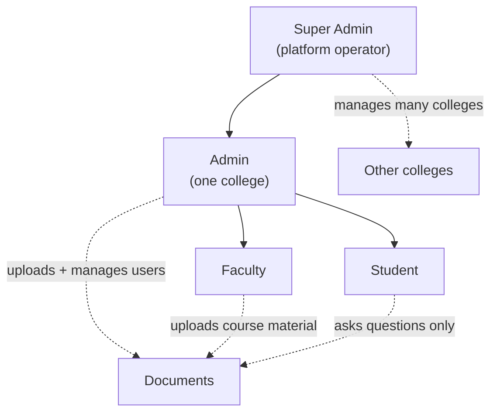
```mermaid
graph TD
    SA["Super Admin<br/>(platform operator)"] --> A["Admin<br/>(one college)"]
    A --> F["Faculty"]
    A --> S["Student"]

    SA -.->|"manages many colleges"| SA2["Other colleges"]
    A -.->|"uploads + manages users"| DOCS["Documents"]
    F -.->|"uploads course material"| DOCS
    S -.->|"asks questions only"| DOCS
```

## 2. Problem Statement › Current workflow

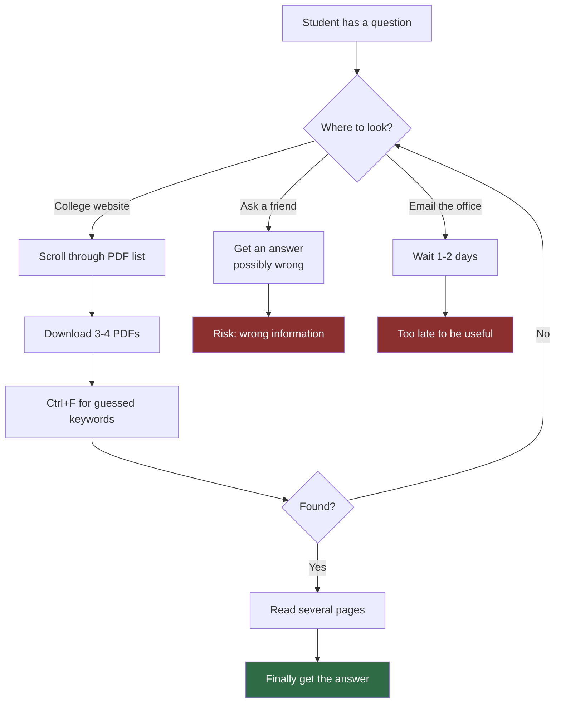
```mermaid
flowchart TD
    Q["Student has a question"] --> W{"Where to look?"}
    W -->|"College website"| P1["Scroll through PDF list"]
    W -->|"Ask a friend"| F["Get an answer<br/>possibly wrong"]
    W -->|"Email the office"| E["Wait 1-2 days"]

    P1 --> D["Download 3-4 PDFs"]
    D --> R["Ctrl+F for guessed keywords"]
    R --> N{"Found?"}
    N -->|"No"| W
    N -->|"Yes"| READ["Read several pages"]
    READ --> ANS["Finally get the answer"]

    F --> RISK["Risk: wrong information"]
    E --> LATE["Too late to be useful"]

    style RISK fill:#8b2f2f,color:#fff
    style LATE fill:#8b2f2f,color:#fff
    style ANS fill:#2f6b45,color:#fff
```

## 3. Problem Statement › Why current systems fail

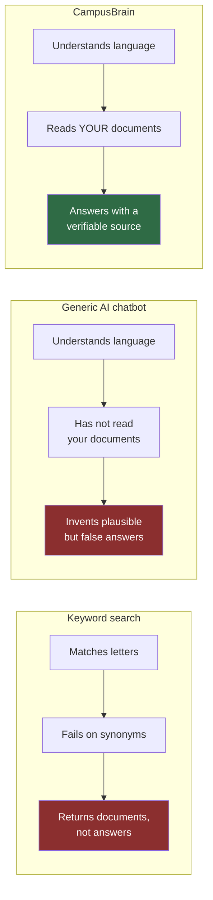
```mermaid
graph LR
    subgraph "Keyword search"
        K1["Matches letters"] --> K2["Fails on synonyms"]
        K2 --> K3["Returns documents,<br/>not answers"]
    end

    subgraph "Generic AI chatbot"
        C1["Understands language"] --> C2["Has not read<br/>your documents"]
        C2 --> C3["Invents plausible<br/>but false answers"]
    end

    subgraph "CampusBrain"
        R1["Understands language"] --> R2["Reads YOUR documents"]
        R2 --> R3["Answers with a<br/>verifiable source"]
    end

    style C3 fill:#8b2f2f,color:#fff
    style K3 fill:#8b2f2f,color:#fff
    style R3 fill:#2f6b45,color:#fff
```

## 4. Solution Overview › How a user interacts with the application

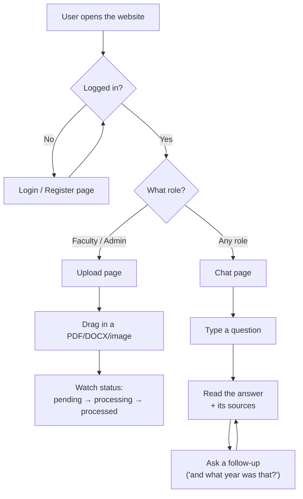
```mermaid
graph TD
    START["User opens the website"] --> AUTH{"Logged in?"}
    AUTH -->|"No"| LOGIN["Login / Register page"]
    LOGIN --> AUTH
    AUTH -->|"Yes"| ROLE{"What role?"}

    ROLE -->|"Faculty / Admin"| UP["Upload page"]
    ROLE -->|"Any role"| CHAT["Chat page"]

    UP --> DROP["Drag in a PDF/DOCX/image"]
    DROP --> WATCH["Watch status:<br/>pending → processing → processed"]

    CHAT --> ASK["Type a question"]
    ASK --> ANS["Read the answer<br/>+ its sources"]
    ANS --> FOLLOW["Ask a follow-up<br/>('and what year was that?')"]
    FOLLOW --> ANS
```

## 5. Solution Overview › The complete workflow, upload to answer › Journey A — Ingestion (happens once per document, in the background)

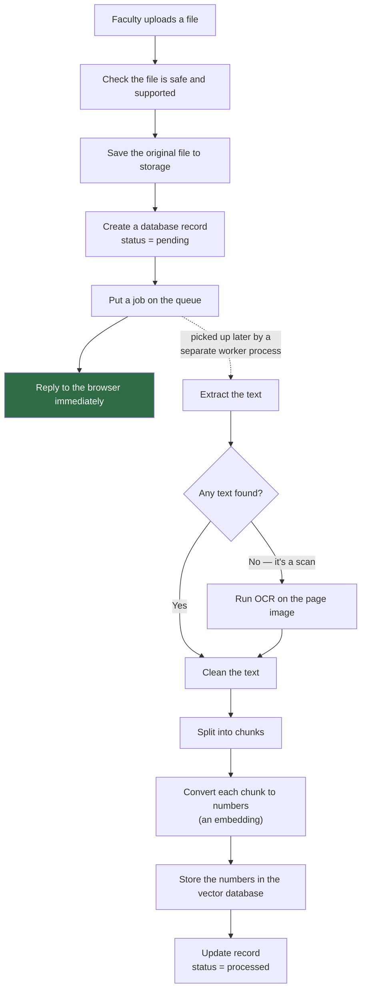
```mermaid
flowchart TD
    U["Faculty uploads a file"] --> V["Check the file is safe and supported"]
    V --> S["Save the original file to storage"]
    S --> DB1["Create a database record<br/>status = pending"]
    DB1 --> Q["Put a job on the queue"]
    Q --> RESP["Reply to the browser immediately"]

    Q -.->|"picked up later by a<br/>separate worker process"| EX["Extract the text"]
    EX --> OCR{"Any text found?"}
    OCR -->|"No — it's a scan"| OCRRUN["Run OCR on the page image"]
    OCR -->|"Yes"| CLEAN["Clean the text"]
    OCRRUN --> CLEAN
    CLEAN --> CH["Split into chunks"]
    CH --> EMB["Convert each chunk to numbers<br/>(an embedding)"]
    EMB --> VEC["Store the numbers in the vector database"]
    VEC --> DB2["Update record<br/>status = processed"]

    style RESP fill:#2f6b45,color:#fff
```

## 6. Solution Overview › The complete workflow, upload to answer › Journey B — Answering (happens every time someone asks)

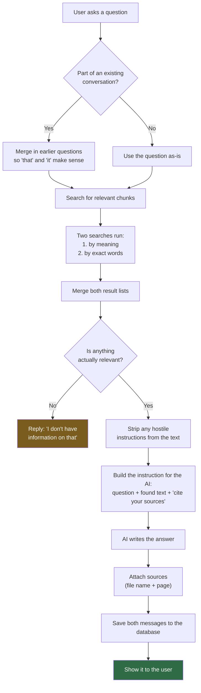
```mermaid
flowchart TD
    Q["User asks a question"] --> HIST{"Part of an existing<br/>conversation?"}
    HIST -->|"Yes"| MERGE["Merge in earlier questions<br/>so 'that' and 'it' make sense"]
    HIST -->|"No"| PLAIN["Use the question as-is"]
    MERGE --> SEARCH
    PLAIN --> SEARCH

    SEARCH["Search for relevant chunks"] --> TWO["Two searches run:<br/>1. by meaning<br/>2. by exact words"]
    TWO --> FUSE["Merge both result lists"]
    FUSE --> GUARD{"Is anything<br/>actually relevant?"}

    GUARD -->|"No"| REFUSE["Reply: 'I don't have<br/>information on that'"]
    GUARD -->|"Yes"| SAN["Strip any hostile<br/>instructions from the text"]
    SAN --> PROMPT["Build the instruction for the AI:<br/>question + found text + 'cite your sources'"]
    PROMPT --> LLM["AI writes the answer"]
    LLM --> CITE["Attach sources<br/>(file name + page)"]
    CITE --> SAVE["Save both messages to the database"]
    SAVE --> SHOW["Show it to the user"]

    style REFUSE fill:#7a5c1e,color:#fff
    style SHOW fill:#2f6b45,color:#fff
```

## 7. System Architecture › The big picture

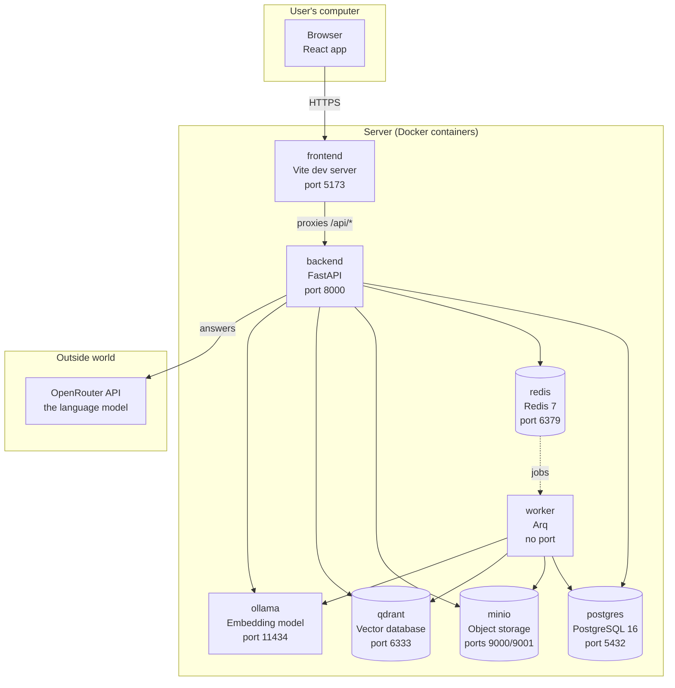
```mermaid
graph TB
    subgraph "User's computer"
        B["Browser<br/>React app"]
    end

    subgraph "Server (Docker containers)"
        FE["frontend<br/>Vite dev server<br/>port 5173"]
        BE["backend<br/>FastAPI<br/>port 8000"]
        WK["worker<br/>Arq<br/>no port"]

        PG[("postgres<br/>PostgreSQL 16<br/>port 5432")]
        RD[("redis<br/>Redis 7<br/>port 6379")]
        MN[("minio<br/>Object storage<br/>ports 9000/9001")]
        QD[("qdrant<br/>Vector database<br/>port 6333")]
        OL["ollama<br/>Embedding model<br/>port 11434"]
    end

    subgraph "Outside world"
        OR["OpenRouter API<br/>the language model"]
    end

    B -->|"HTTPS"| FE
    FE -->|"proxies /api/*"| BE

    BE --> PG
    BE --> RD
    BE --> MN
    BE --> QD
    BE --> OL
    BE -->|"answers"| OR

    RD -.->|"jobs"| WK
    WK --> PG
    WK --> MN
    WK --> QD
    WK --> OL
```

## 8. System Architecture › The layered architecture inside the backend

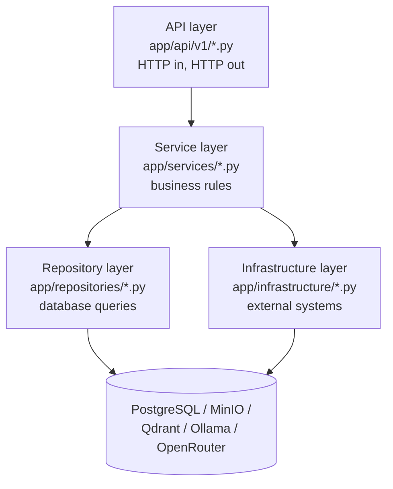
```mermaid
graph TD
    API["API layer<br/>app/api/v1/*.py<br/>HTTP in, HTTP out"]
    SVC["Service layer<br/>app/services/*.py<br/>business rules"]
    REPO["Repository layer<br/>app/repositories/*.py<br/>database queries"]
    INF["Infrastructure layer<br/>app/infrastructure/*.py<br/>external systems"]
    DB[("PostgreSQL / MinIO /<br/>Qdrant / Ollama / OpenRouter")]

    API --> SVC
    SVC --> REPO
    SVC --> INF
    REPO --> DB
    INF --> DB
```

## 9. System Architecture › The layered architecture inside the backend (2)

```
POST /api/v1/ask   {"question": "Who founded the university?"}
   │
   ├─ api/v1/ask.py           checks the JWT, gets org_id=1 from it
   │                          calls answer_question(db, 1, "Who founded...")
   │
   ├─ services/rag_service.py decides: search, then guard, then prompt, then LLM
   │      │
   │      ├─ services/retrieval_service.py  runs the two searches and fuses them
   │      │       ├─ infrastructure/embeddings.py  question → 1024 numbers
   │      │       └─ infrastructure/vector_store.py  find nearest vectors
   │      │
   │      └─ infrastructure/llm/provider.py   sends the prompt to OpenRouter
   │
   └─ api/v1/ask.py           looks up file names, shapes the JSON reply
```

## 10. System Architecture › Multi-tenancy — keeping colleges separate

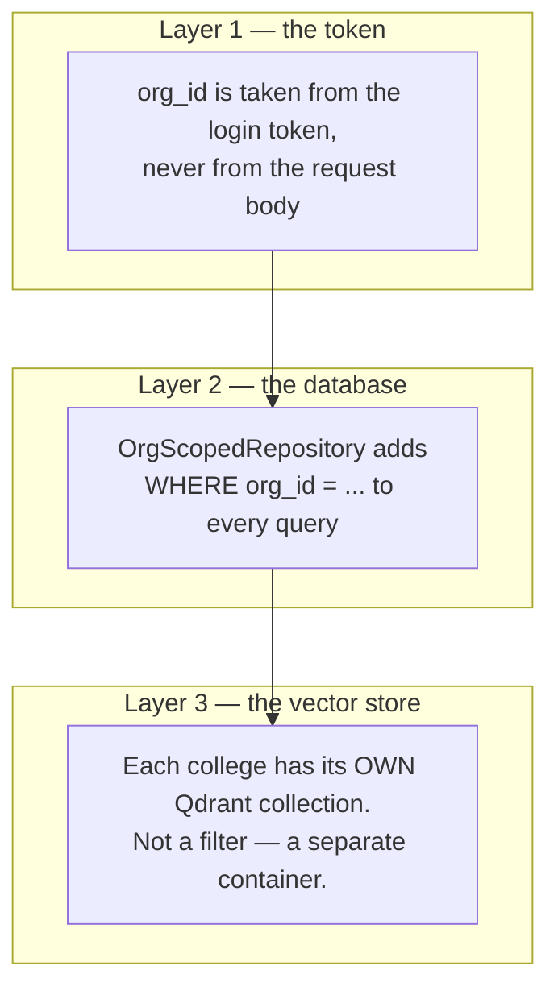
```mermaid
graph TD
    subgraph "Layer 1 — the token"
        T["org_id is taken from the login token,<br/>never from the request body"]
    end
    subgraph "Layer 2 — the database"
        R["OrgScopedRepository adds<br/>WHERE org_id = ... to every query"]
    end
    subgraph "Layer 3 — the vector store"
        V["Each college has its OWN Qdrant collection.<br/>Not a filter — a separate container."]
    end

    T --> R --> V
```

## 11. Folder Structure › How a request flows between folders

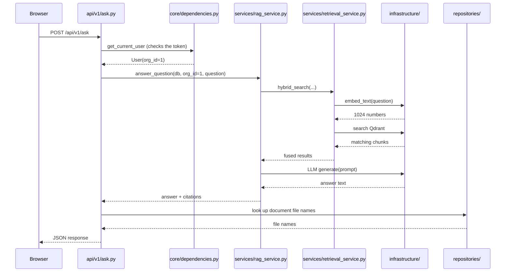
```mermaid
sequenceDiagram
    participant Browser
    participant api as api/v1/ask.py
    participant dep as core/dependencies.py
    participant svc as services/rag_service.py
    participant ret as services/retrieval_service.py
    participant inf as infrastructure/
    participant repo as repositories/

    Browser->>api: POST /api/v1/ask
    api->>dep: get_current_user (checks the token)
    dep-->>api: User(org_id=1)
    api->>svc: answer_question(db, org_id=1, question)
    svc->>ret: hybrid_search(...)
    ret->>inf: embed_text(question)
    inf-->>ret: 1024 numbers
    ret->>inf: search Qdrant
    inf-->>ret: matching chunks
    ret-->>svc: fused results
    svc->>inf: LLM generate(prompt)
    inf-->>svc: answer text
    svc-->>api: answer + citations
    api->>repo: look up document file names
    repo-->>api: file names
    api-->>Browser: JSON response
```

## 12. Complete Backend Pipeline › 7.1 Ingestion — step by step

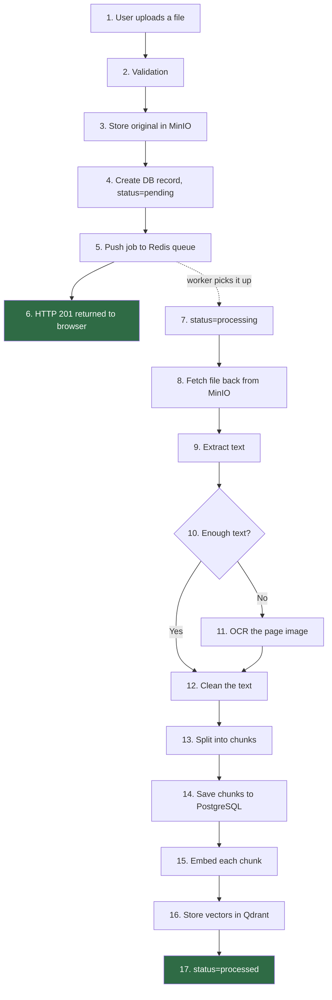
```mermaid
flowchart TD
    A["1. User uploads a file"] --> B["2. Validation"]
    B --> C["3. Store original in MinIO"]
    C --> D["4. Create DB record, status=pending"]
    D --> E["5. Push job to Redis queue"]
    E --> F["6. HTTP 201 returned to browser"]

    E -.->|"worker picks it up"| G["7. status=processing"]
    G --> H["8. Fetch file back from MinIO"]
    H --> I["9. Extract text"]
    I --> J{"10. Enough text?"}
    J -->|"No"| K["11. OCR the page image"]
    J -->|"Yes"| L["12. Clean the text"]
    K --> L
    L --> M["13. Split into chunks"]
    M --> N["14. Save chunks to PostgreSQL"]
    N --> O["15. Embed each chunk"]
    O --> P["16. Store vectors in Qdrant"]
    P --> Q["17. status=processed"]

    style F fill:#2f6b45,color:#fff
    style Q fill:#2f6b45,color:#fff
```

## 13. Complete Backend Pipeline › 7.2 Answering — step by step

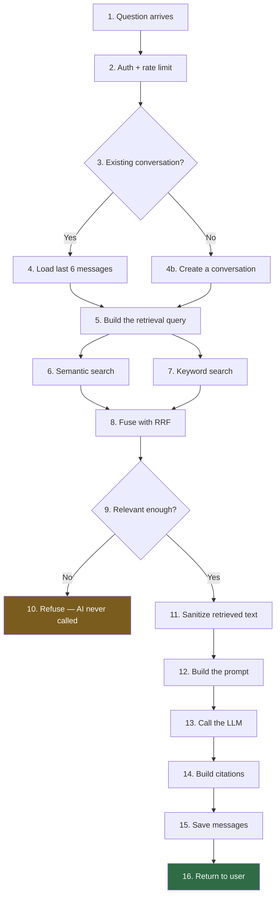
```mermaid
flowchart TD
    A["1. Question arrives"] --> B["2. Auth + rate limit"]
    B --> C{"3. Existing conversation?"}
    C -->|"Yes"| D["4. Load last 6 messages"]
    C -->|"No"| E["4b. Create a conversation"]
    D --> F["5. Build the retrieval query"]
    E --> F
    F --> G["6. Semantic search"]
    F --> H["7. Keyword search"]
    G --> I["8. Fuse with RRF"]
    H --> I
    I --> J{"9. Relevant enough?"}
    J -->|"No"| K["10. Refuse — AI never called"]
    J -->|"Yes"| L["11. Sanitize retrieved text"]
    L --> M["12. Build the prompt"]
    M --> N["13. Call the LLM"]
    N --> O["14. Build citations"]
    O --> P["15. Save messages"]
    P --> Q["16. Return to user"]

    style K fill:#7a5c1e,color:#fff
    style Q fill:#2f6b45,color:#fff
```

## 14. Frontend Pipeline › Screens

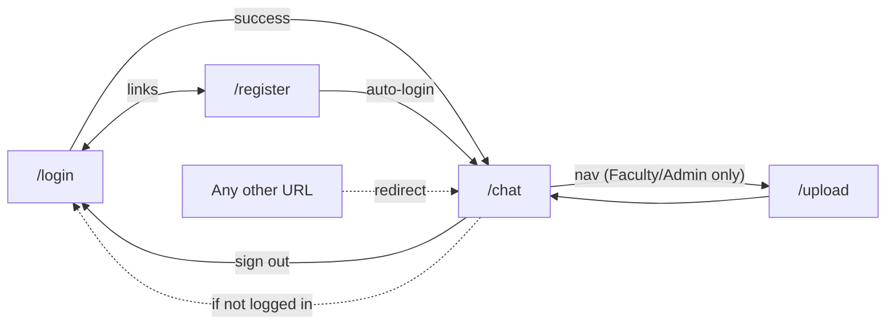
```mermaid
graph LR
    L["/login"] -->|"success"| C["/chat"]
    R["/register"] -->|"auto-login"| C
    L <-->|"links"| R
    C -->|"nav (Faculty/Admin only)"| U["/upload"]
    U --> C
    C -->|"sign out"| L

    ANY["Any other URL"] -.->|"redirect"| C
    C -.->|"if not logged in"| L
```

## 15. Frontend Pipeline › The authentication hook

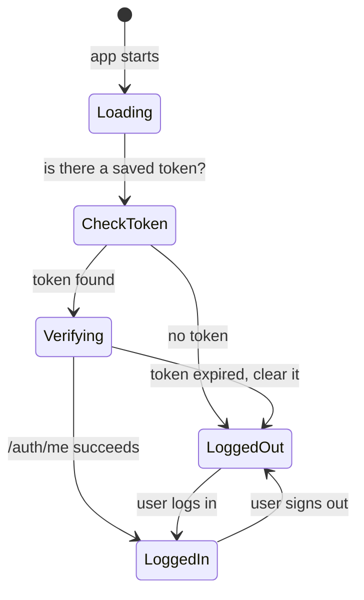
```mermaid
stateDiagram-v2
    [*] --> Loading: app starts
    Loading --> CheckToken: is there a saved token?
    CheckToken --> LoggedOut: no token
    CheckToken --> Verifying: token found
    Verifying --> LoggedIn: /auth/me succeeds
    Verifying --> LoggedOut: token expired, clear it
    LoggedOut --> LoggedIn: user logs in
    LoggedIn --> LoggedOut: user signs out
```

## 16. Database Design › The complete schema

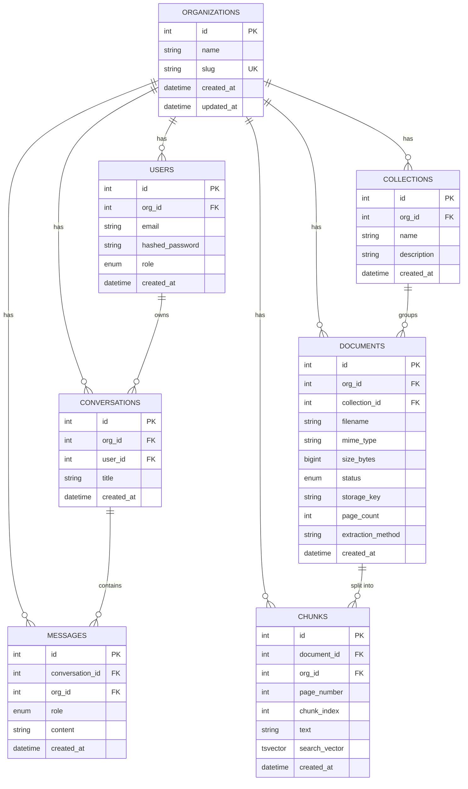
```mermaid
erDiagram
    ORGANIZATIONS ||--o{ USERS : "has"
    ORGANIZATIONS ||--o{ COLLECTIONS : "has"
    ORGANIZATIONS ||--o{ DOCUMENTS : "has"
    ORGANIZATIONS ||--o{ CHUNKS : "has"
    ORGANIZATIONS ||--o{ CONVERSATIONS : "has"
    ORGANIZATIONS ||--o{ MESSAGES : "has"
    COLLECTIONS ||--o{ DOCUMENTS : "groups"
    DOCUMENTS ||--o{ CHUNKS : "split into"
    USERS ||--o{ CONVERSATIONS : "owns"
    CONVERSATIONS ||--o{ MESSAGES : "contains"

    ORGANIZATIONS {
        int id PK
        string name
        string slug UK
        datetime created_at
        datetime updated_at
    }
    USERS {
        int id PK
        int org_id FK
        string email
        string hashed_password
        enum role
        datetime created_at
    }
    COLLECTIONS {
        int id PK
        int org_id FK
        string name
        string description
        datetime created_at
    }
    DOCUMENTS {
        int id PK
        int org_id FK
        int collection_id FK
        string filename
        string mime_type
        bigint size_bytes
        enum status
        string storage_key
        int page_count
        string extraction_method
        datetime created_at
    }
    CHUNKS {
        int id PK
        int document_id FK
        int org_id FK
        int page_number
        int chunk_index
        string text
        tsvector search_vector
        datetime created_at
    }
    CONVERSATIONS {
        int id PK
        int org_id FK
        int user_id FK
        string title
        datetime created_at
    }
    MESSAGES {
        int id PK
        int conversation_id FK
        int org_id FK
        enum role
        string content
        datetime created_at
    }
```

## 17. Database Design › Table by table › documents

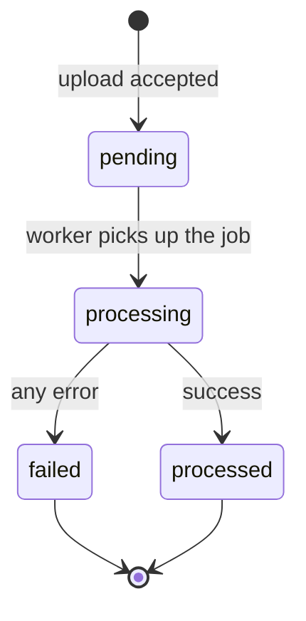
```mermaid
stateDiagram-v2
    [*] --> pending: upload accepted
    pending --> processing: worker picks up the job
    processing --> processed: success
    processing --> failed: any error
    failed --> [*]
    processed --> [*]
```

## 18. Authentication & Authorization › How login works

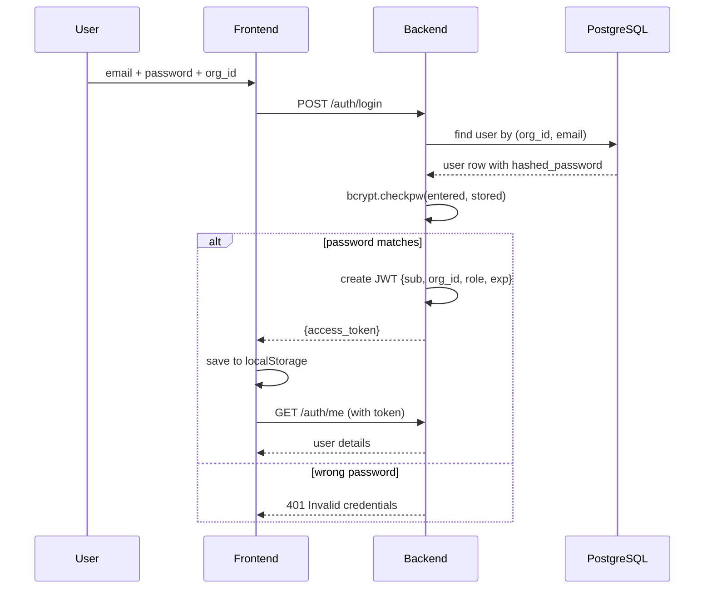
```mermaid
sequenceDiagram
    participant U as User
    participant F as Frontend
    participant B as Backend
    participant DB as PostgreSQL

    U->>F: email + password + org_id
    F->>B: POST /auth/login
    B->>DB: find user by (org_id, email)
    DB-->>B: user row with hashed_password
    B->>B: bcrypt.checkpw(entered, stored)
    alt password matches
        B->>B: create JWT {sub, org_id, role, exp}
        B-->>F: {access_token}
        F->>F: save to localStorage
        F->>B: GET /auth/me (with token)
        B-->>F: user details
    else wrong password
        B-->>F: 401 Invalid credentials
    end
```

## 19. Authentication & Authorization › What a JWT is

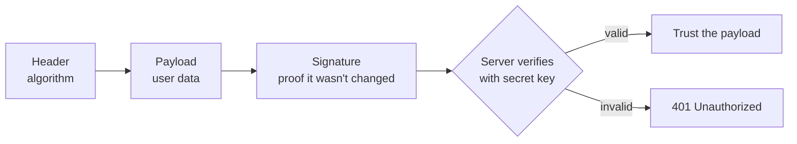
```mermaid
graph LR
    H["Header<br/>algorithm"] --> P["Payload<br/>user data"] --> S["Signature<br/>proof it wasn't changed"]
    S --> V{"Server verifies<br/>with secret key"}
    V -->|"valid"| OK["Trust the payload"]
    V -->|"invalid"| NO["401 Unauthorized"]
```

## 20. Authentication & Authorization › Tenant isolation

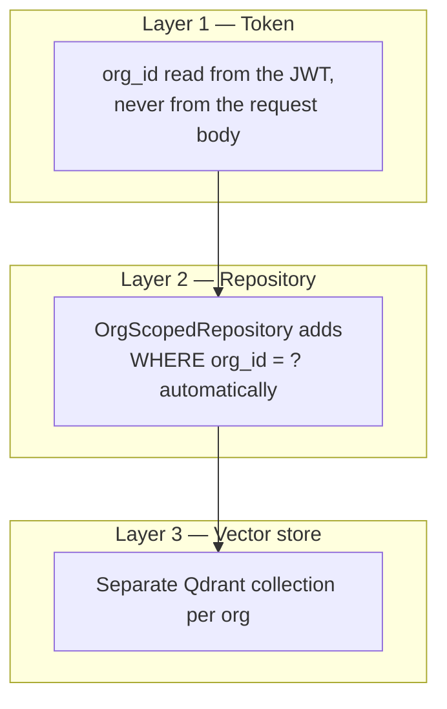
```mermaid
graph TD
    subgraph "Layer 1 — Token"
        A["org_id read from the JWT,<br/>never from the request body"]
    end
    subgraph "Layer 2 — Repository"
        B["OrgScopedRepository adds<br/>WHERE org_id = ? automatically"]
    end
    subgraph "Layer 3 — Vector store"
        C["Separate Qdrant collection per org"]
    end
    A --> B --> C
```

## 21. Document Processing Pipeline › The routing decision

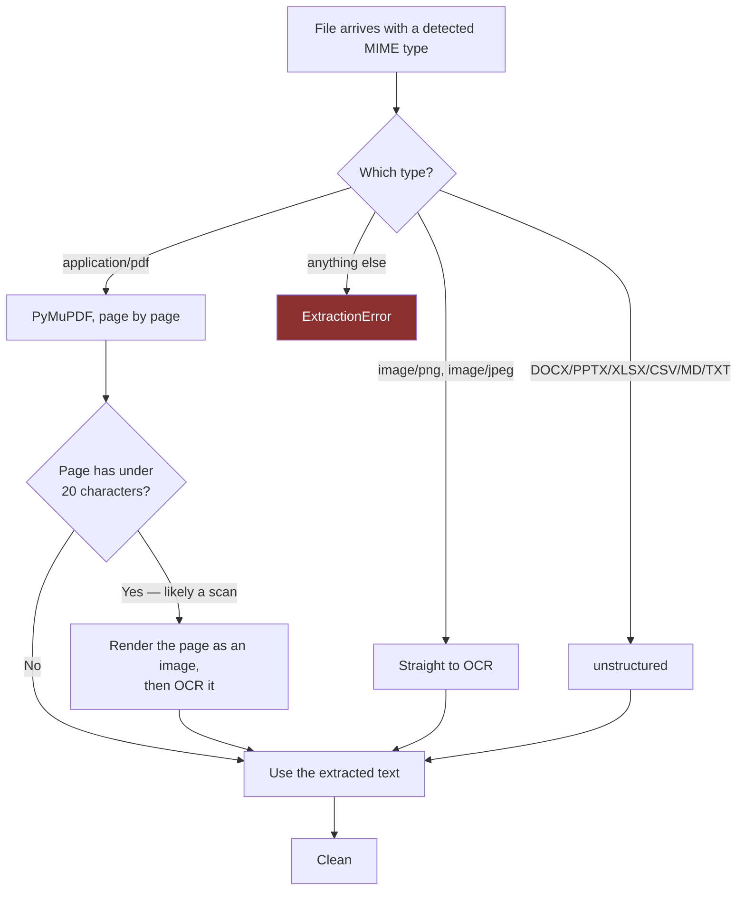
```mermaid
flowchart TD
    F["File arrives with a detected MIME type"] --> R{"Which type?"}
    R -->|"application/pdf"| PDF["PyMuPDF, page by page"]
    R -->|"DOCX/PPTX/XLSX/CSV/MD/TXT"| UNS["unstructured"]
    R -->|"image/png, image/jpeg"| OCR1["Straight to OCR"]
    R -->|"anything else"| ERR["ExtractionError"]

    PDF --> CHK{"Page has under<br/>20 characters?"}
    CHK -->|"Yes — likely a scan"| OCR2["Render the page as an image,<br/>then OCR it"]
    CHK -->|"No"| TXT["Use the extracted text"]
    OCR2 --> TXT
    OCR1 --> TXT
    UNS --> TXT
    TXT --> CLEAN["Clean"]

    style ERR fill:#8b2f2f,color:#fff
```

## 22. Document Processing Pipeline › How OCR actually works

```mermaid
flowchart LR
    P["PDF page"] --> IMG["Render to a PNG image"]
    IMG --> DET["Detection:<br/>where is there text?"]
    DET --> CLS["Angle classification:<br/>is it upside down?"]
    CLS --> REC["Recognition:<br/>which characters?"]
    REC --> TXT["Text out"]
```

## 23. Document Processing Pipeline › Chunking

```mermaid
flowchart TD
    T["Text longer than 1000 characters"] --> S1{"Split on blank lines?"}
    S1 -->|"pieces still too big"| S2{"Split on single newlines?"}
    S1 -->|"fits"| DONE["Done"]
    S2 -->|"still too big"| S3{"Split on '. '?"}
    S2 -->|"fits"| DONE
    S3 -->|"still too big"| S4{"Split on spaces?"}
    S3 -->|"fits"| DONE
    S4 -->|"still too big"| S5["Cut mid-word (last resort)"]
    S4 -->|"fits"| DONE
```

## 24. Retrieval Pipeline › Three search strategies

```mermaid
flowchart TD
    Q["Question"] --> A["Semantic search<br/>(by meaning)"]
    Q --> B["Keyword search<br/>(by exact words)"]
    A --> C["Fuse with RRF"]
    B --> C
    C --> D["Final ranked list"]
```

## 25. LLM Pipeline › Anatomy of the prompt

```mermaid
graph TD
    A["Role: 'You are a helpful assistant<br/>for an educational institution'"] --> B["Constraint: 'Answer using ONLY<br/>the numbered context below'"]
    B --> C["Citation rule: 'Cite sources<br/>inline as [1]'"]
    C --> D["Escape hatch: 'If the context does not<br/>contain the answer, say exactly …'"]
    D --> E["Conversation history<br/>(if any)"]
    E --> F["The retrieved chunks,<br/>numbered [1] [2] [3]…"]
    F --> G["The question"]
    G --> H["'Answer:'"]
```

## 26. RAG Pipeline › The complete picture

```mermaid
flowchart TD
    subgraph "Offline — once per document"
        D["Document"] --> E1["Extract text"]
        E1 --> C1["Chunk"]
        C1 --> EM1["Embed"]
        EM1 --> V["Vector DB"]
    end

    subgraph "Online — every question"
        Q["Question"] --> EM2["Embed the question"]
        EM2 --> S["Search the vector DB"]
        V -.-> S
        S --> K["Top 5 chunks"]
        K --> G{"Relevant enough?"}
        G -->|"No"| R["Refuse"]
        G -->|"Yes"| P["Build prompt"]
        P --> L["LLM"]
        L --> A["Answer + citations"]
    end

    style R fill:#7a5c1e,color:#fff
    style A fill:#2f6b45,color:#fff
```

## 27. RAG Pipeline › Why citations matter

```mermaid
graph LR
    A["Answer without a source"] --> B{"Is it true?"}
    B --> C["No way to know<br/>without redoing the research"]

    D["Answer with a source"] --> E["Open page 12"]
    E --> F["Verify in 5 seconds"]

    style C fill:#8b2f2f,color:#fff
    style F fill:#2f6b45,color:#fff
```

## 28. RAG Pipeline › How hallucinations happen

```mermaid
flowchart TD
    Q["'What is the attendance rule?'"] --> M{"Does the model<br/>have this fact?"}
    M -->|"No"| P["It predicts the most<br/>plausible-sounding text"]
    P --> H["'Students require 75% attendance'<br/>— completely invented"]
    M -->|"Yes, from context"| T["Accurate answer"]

    style H fill:#8b2f2f,color:#fff
    style T fill:#2f6b45,color:#fff
```

## 29. Background Jobs › Why a queue exists at all

```mermaid
sequenceDiagram
    participant API as backend
    participant R as Redis
    participant W as worker

    API->>R: enqueue_job("process_document", 15)
    API-->>API: return HTTP 201 immediately
    Note over W: worker is polling Redis
    R->>W: here is job 15
    W->>W: extract, chunk, embed, store (248s)
    W->>R: mark complete
```

## 30. Error Handling › Errors by layer

```mermaid
graph TD
    U["User input errors"] --> A["400 / 409 / 422<br/>clear message, user can fix"]
    AU["Authentication errors"] --> B["401 / 403"]
    EX["External service errors"] --> C["Retry, or fail the job"]
    PR["Processing errors"] --> D["status = failed, worker survives"]
    BU["Programming bugs"] --> E["500 — should never reach a user"]

    style E fill:#8b2f2f,color:#fff
```

## 31. Security › Threat model

```mermaid
graph TD
    A["Attacker"] --> B["Steal another college's documents"]
    A --> C["Read another user's chats"]
    A --> D["Become an admin"]
    A --> E["Break the AI's rules"]
    A --> F["Upload something harmful"]
    A --> G["Guess a password"]
    A --> H["Overwhelm the service"]
```

## 32. Performance Optimization › The two real bottlenecks

```mermaid
graph LR
    subgraph "Ingestion — 248s"
        A["Extract 5s"] --> B["Chunk under 1s"] --> C["Embed 235s ← THE PROBLEM"] --> D["Store 5s"]
    end
```

## 33. Performance Optimization › The two real bottlenecks (2)

```mermaid
graph LR
    subgraph "Answering — 5-12s"
        E["Embed query 1-2s"] --> F["Search under 0.1s"] --> G["LLM 2-10s ← THE PROBLEM"]
    end
```

## 34. Production Deployment › What a production deployment needs

```mermaid
graph TD
    U["Users"] -->|"HTTPS"| N["Nginx<br/>TLS termination"]
    N -->|"/"| S["Static frontend<br/>(built files)"]
    N -->|"/api"| B["Backend containers<br/>(2+ copies)"]
    B --> PG[("PostgreSQL<br/>not publicly exposed")]
    B --> RD[("Redis")]
    B --> MN[("MinIO")]
    B --> QD[("Qdrant")]
    W["Workers (2+)"] --> PG
    W --> QD
    RD -.-> W
    PG -.->|"nightly"| BK["Backups"]
```

## 35. Algorithms Used › Recursive character splitting

```mermaid
flowchart TD
    A["Text too long?"] -->|"No"| B["Keep as one chunk"]
    A -->|"Yes"| C["Split on the best available separator"]
    C --> D["For each resulting piece"]
    D --> A
```

## 36. Algorithms Used › Cosine similarity

```mermaid
graph LR
    O["origin"] --> A["'dog'"]
    O --> B["'puppy'"]
    O --> C["'car'"]
```

## 37. Algorithms Used › Approximate Nearest Neighbour (ANN) and HNSW

```mermaid
graph TD
    subgraph "Layer 2 — few nodes, long jumps"
        A2["A"] --- B2["B"]
    end
    subgraph "Layer 1 — more nodes"
        A1["A"] --- C1["C"] --- B1["B"]
    end
    subgraph "Layer 0 — every node"
        A0["A"] --- D0["D"] --- C0["C"] --- E0["E"] --- B0["B"]
    end
    A2 -.-> A1 -.-> A0
```

## 38. Complete User Journey › Journey 1 — a new student, first question

```mermaid
sequenceDiagram
    actor S as Student
    participant FE as Frontend
    participant BE as Backend
    participant DB as PostgreSQL
    participant Q as Qdrant
    participant AI as OpenRouter

    S->>FE: opens the site
    FE->>FE: no saved token → /login
    S->>FE: clicks "Register"
    S->>FE: org 1, email, password
    FE->>BE: POST /auth/register
    BE->>BE: hash the password (bcrypt)
    BE->>DB: INSERT user, role=student (forced)
    BE-->>FE: 201
    FE->>BE: POST /auth/login
    BE-->>FE: JWT
    FE->>FE: save token, go to /chat

    S->>FE: "Who founded the university?"
    FE->>BE: POST /chat
    BE->>BE: verify token → org_id=1
    BE->>BE: rate limit OK
    BE->>DB: create conversation
    BE->>BE: embed the question
    BE->>Q: search org_1 collection
    Q-->>BE: 5 chunks
    BE->>DB: keyword search
    DB-->>BE: 5 chunks
    BE->>BE: fuse (RRF), check relevance
    BE->>BE: sanitize, build prompt
    BE->>AI: prompt
    AI-->>BE: "Dr. Amit Singhal [1]"
    BE->>DB: save both messages
    BE-->>FE: answer + citations
    FE->>S: answer with sources
```

## 39. Complete User Journey › Journey 2 — faculty uploading a document

```mermaid
sequenceDiagram
    actor F as Faculty
    participant FE as Frontend
    participant BE as Backend
    participant MN as MinIO
    participant R as Redis
    participant W as Worker

    F->>FE: drags syllabus.pdf onto the dropzone
    FE->>BE: POST /documents
    BE->>BE: role check (Faculty ✓)
    BE->>BE: sniff bytes → application/pdf ✓
    BE->>BE: size ✓
    BE->>MN: store as 1/<uuid>.pdf
    BE->>BE: INSERT document, status=pending
    BE->>R: enqueue job
    BE-->>FE: 201 (under 1 second)
    FE->>F: row shows "pending"

    R->>W: job
    W->>BE: status=processing
    FE->>BE: poll every 2s
    FE->>F: "processing"

    W->>MN: fetch the file
    W->>W: extract text (OCR if needed)
    W->>W: clean, chunk
    W->>W: embed each chunk
    W->>W: store vectors
    W->>BE: status=processed
    FE->>F: "Processed" in green
```

## 40. Future Improvements › Tier 4 — the ambitious items › Agentic RAG

```mermaid
graph LR
    Q["Question"] --> A{"Agent decides"}
    A -->|"search"| S["Retrieve"]
    S --> A
    A -->|"not enough"| S
    A -->|"enough"| ANS["Answer"]
```

## 41. Cheat Sheet › Request flow

```
Browser → Vite proxy → FastAPI → [JWT check] → [rate limit]
  → embed question → Qdrant search + Postgres FTS → RRF fuse
  → relevance guard → sanitise → prompt → LLM → citations → JSON
```

## 42. Cheat Sheet › Ingestion flow

```
Upload → validate (sniff bytes, size, collection) → MinIO
  → DB row (pending) → Redis job → [return 201]
  ... worker ... → extract → OCR if needed → clean → chunk
  → embed each → Qdrant → status processed
```

