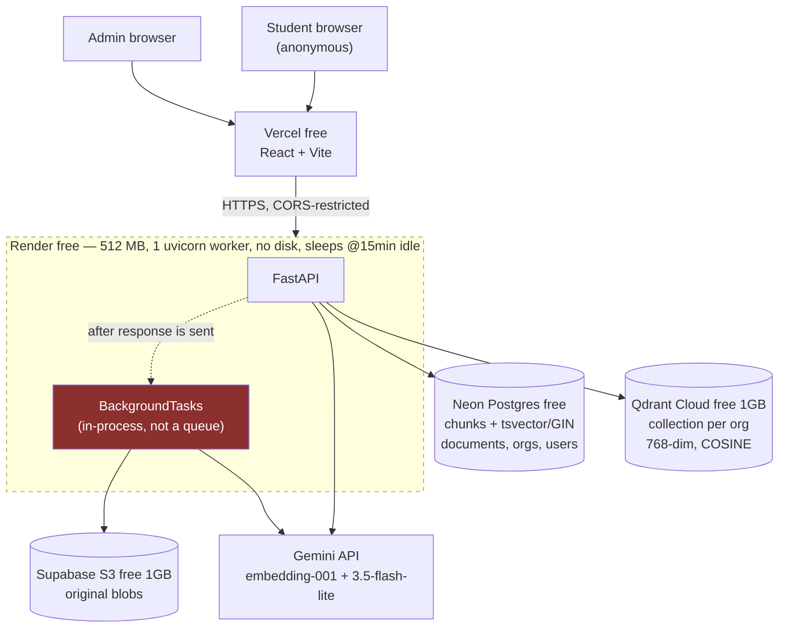
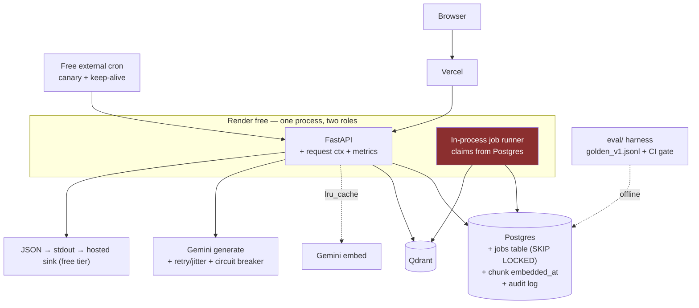

# CampusBrain AI — Production Engineering Master Roadmap

**Status:** Living document · **Created:** 2026-07-30 · **Last revised:** 2026-07-30
**Owner:** Ishant Bhoyar · **Repo:** `github.com/ISHANT57/CampusBrain` · **Branch:** `fix/counting-answers` (`f7b0668`)

---

## How to maintain this document

**Never recreate this file.** Append, revise, or mark superseded. The history is the value —
a roadmap that only shows the current plan teaches nothing about how the plan was reached.

| Rule | Why |
|---|---|
| ADRs are **immutable** once written | Supersede with a new ADR that references the old one. Deleting a decision deletes the reasoning that produced it |
| Incidents are **append-only** | The incident library is the most interview-valuable section here |
| Every backlog item states **the production problem it solves** | An item that cannot name one gets deleted, not built |
| Distinguish **Designed** from **Implemented** | See the note below. This is the single most important rule in the file |
| Update §12 scorecard **only after implementation**, never after design | |
| Revision log at the bottom of the file | |

### The Designed/Implemented distinction

This project's entire premise is that you can defend every claim in an interview. A roadmap
that marks a pillar "complete" because a design document exists would be the exact failure
mode the project is built to avoid.

> **Design ≠ Implementation ≠ Verified.** A pillar is only `Completed` when the code is
> merged, the tests pass, **and the failure injections from its §9 have been performed and
> the observations recorded.** Until then it is `Designed`, and the scorecard does not move.

Verified as of 2026-07-30: `git diff --stat HEAD -- backend/ frontend/` is **empty**. No
application code has changed since this effort began. Pillar 2 is `Designed — 0% implemented`.

---

## 1. Current Architecture

### 1.1 The system as deployed



The red node is the highest-risk component in the system: in-process background work on an
instance that sleeps. See **P0-1**.

### 1.2 Tech stack — verified against source, not documentation

| Layer | Choice | Free-tier limit that binds |
|---|---|---|
| Frontend | React 18 + Vite + TypeScript, Vercel | — |
| API | FastAPI + uvicorn, **`--workers 1`** (`scripts/render-start.sh`) | 512 MB RAM |
| ORM / migrations | SQLAlchemy 2.0 + Alembic | — |
| Relational | Neon Postgres | Free-tier retention; no PITR |
| Keyword search | Postgres `TSVECTOR` **stored generated column** + **GIN** index, `ts_rank` | — |
| Vector | Qdrant Cloud, one collection per org, HNSW defaults | **1 GB** |
| Blobs | Supabase (S3 API) via boto3 | 1 GB |
| Embeddings | `gemini-embedding-001`, `output_dimensionality=768` (Matryoshka from 3072) | Daily request quota |
| Generation | `gemini-3.5-flash-lite` via raw REST/httpx | Daily request quota |
| Extraction | PyMuPDF · `unstructured` (13 MIME types) · PaddleOCR fallback | Import weight vs 512 MB |
| Rate limiting | `slowapi`, **in-memory store** | Correct only at 1 worker |
| Queue | **None** — FastAPI `BackgroundTasks` | — |
| Cache | **None** | — |
| Redis | **None.** Present only in comments recording its removal | — |
| Observability | **None on the request path** | — |

> **Premise correction, kept permanently.** Early planning assumed Redis was in the stack.
> It is not, and never was in this deployment. It appears only at
> `document_processing_service.py:96`, `documents.py:55` and `rate_limit.py:54`, each
> recording its *removal*. Any design assuming a durable queue, a shared rate-limit store or
> a cache is invalid until Redis is deliberately added — and §7 argues it should not be.

### 1.3 Request flow — chat (the hot path)

```
POST /api/v1/chat/{org_slug}          no auth by design; 120/min per IP
  └─ _org_id(slug)                     Organization lookup, 404 on unknown
  └─ answer_question()
      ├─ retrieval_query = " ".join(prior user turns) + question    ← naive; drifts (P2-13)
      ├─ hybrid_search()
      │   ├─ semantic: embed(query) → Qdrant ANN, fetch max(top_k*4, 20)
      │   └─ keyword:  _discriminating_terms() → drop terms >10% doc-freq
      │                _to_or_tsquery()        → "a | b | c"
      │                Postgres ts_rank over GIN, fetch max(top_k*4, 20)
      ├─ RRF fuse, K=60, 1/(K+rank) summed; semantic_score carried separately
      ├─ GUARDRAIL: best semantic_score < 0.35 → NO_EVIDENCE_RESPONSE, no LLM call
      ├─ sanitize_context()            5 injection regexes on retrieved text
      ├─ build_rag_prompt()            numbered context, 3 behavioural clauses
      ├─ Gemini generateContent        buffered; no retry; usageMetadata discarded
      └─ keep_cited_sources()          parse [n] and [a,b,c], drop out-of-range, renumber
  └─ hydrate filenames                 DocumentRepository.get() per citation  ← N+1
```

### 1.4 Request flow — ingestion

```
POST /api/v1/documents                 ADMIN | SUPER_ADMIN; NO rate limit
  ├─ content = await file.read()       ENTIRE BODY INTO 512 MB  ← P0-2
  ├─ size check (100 MB)               runs AFTER the read
  ├─ magic MIME sniff; (ext, mime) PAIR must be allow-listed
  ├─ storage key = "{org_id}/{uuid4}{safe_ext}"   client filename never used
  ├─ INSERT Document(status=PENDING)   content_hash left NULL  ← P0-3
  └─ background_tasks.add_task(process_document)  ← in-process  ← P0-1

process_document()                     runs AFTER the response is sent
  ├─ status = PROCESSING
  ├─ extract → clean per page
  ├─ DELETE Qdrant points, then DELETE chunk rows   ← destructive; no rollback  ← P0-1(b)
  ├─ chunk_pages()                     recursive, 1000/200, PER PAGE
  ├─ for chunk in chunks: embed()      SEQUENTIAL HTTP — 47 chunks ≈ 248 s  ← P1-8
  ├─ upsert_chunks()                   one Qdrant call
  └─ status = PROCESSED  |  except Exception → FAILED + print()  ← swallowed
```

### 1.5 Binding infrastructure constraints

Every design must survive these. Two have already caused recorded incidents.

| Constraint | Evidence | Design consequence |
|---|---|---|
| 512 MB RAM total | `DEPLOYMENT_JOURNAL.md:250` — OOM already occurred | No in-memory upload buffering, no 2nd worker, no `torch` |
| Sleeps after 15 min idle | `DEPLOYMENT_JOURNAL.md:619` | **In-process background work can die mid-flight** |
| One worker, deliberate | `scripts/render-start.sh` | No parallelism; in-memory rate limiting is *correct* here |
| No persistent disk | `DEPLOYMENT_JOURNAL.md:98` | No file queue, no SQLite sidecar, no disk cache |
| No Shell tab on free tier | `scripts/render-start.sh` | Every op is a startup script, an endpoint, or a migration |
| Gemini daily quota | INC-002 | Quota ≠ rate. Retries cannot fix a daily cap |

### 1.6 Current limitations (one line each, expanded in §4)

Ingestion is not durable · uploads are read whole into memory · API uploads cannot dedupe ·
nothing on the request path is logged · no retries on any model call · cost is unmeasured ·
no evaluation exists · no CI · `RELEVANCE_THRESHOLD` is unvalidated · chunk parameters were
never tuned · the extraction path is untestable by construction · no backups · no alerting.

---

## 2. Engineering Vision

### 2.1 Current maturity — **Level 2 of 5**

| Level | Description | CampusBrain |
|---|---|---|
| 1 — Prototype | Runs locally, one happy path | passed |
| **2 — Deployed demo** | **Publicly reachable, real data, no operational envelope** | **← here** |
| 3 — Operable | Failures are visible, recoverable, and attributable | target |
| 4 — Measured | Quality and cost are quantified; changes are gated on evidence | target |
| 5 — Evolving | Scaling and migration triggers are defined and rehearsed | stretch |

The gap between 2 and 3 is **not features**. It is: can a failure be seen, can work survive a
restart, and can a wrong answer be reconstructed.

### 2.2 Target maturity — Level 4, honestly achieved

Level 4 by the end of Pillars 1, 2, 5, 7 and 10. Level 5 partially, through §7 — because
*documented, reasoned migration triggers* are themselves a Level 5 artifact and cost nothing
but thought. **This is the highest-leverage insight in the roadmap:** you cannot demonstrate
operating at scale on free infrastructure, but you can demonstrate knowing precisely when
and why each design stops being correct. That is what §7 is for.

### 2.3 Production readiness — **Not ready**

Three gates, none currently passed:

1. **A document upload cannot silently vanish.** Today it can, and the deployment target
   guarantees the conditions.
2. **A wrong answer from yesterday can be reconstructed.** Today it cannot.
3. **A quality change can be measured.** Today it cannot — seven tuning decisions are blocked.

### 2.4 Long-term architecture

The end state on free infrastructure. Nothing here requires a paid tier.



The essential move: **the queue becomes a Postgres table, not a new service.** The worker is
still in-process, but the *work* is durable — so a sleeping instance loses progress, not
data, and the reaper recovers it.

---

## 3. Pillar Progress Tracker

Two axes, deliberately. Design is cheap and Implementation is what counts.

| # | Pillar | Design | Impl | Status | Priority | Depends on | Effort | Business impact | Interview value |
|---|---|---|---|---|---|---|---|---|---|
| 2 | **Observability** | 100% | **0%** | **Designed** | **P0** | — | 1 d | Debuggability; unblocks all | ★★★★★ |
| 1 | **Reliability** | 20% | 0% | In Progress | **P0** | 2 | 3 d | Prevents data loss | ★★★★★ |
| 7 | **Cost Engineering** | 30% | 0% | Not Started | P1 | 2 | 2 h | Makes spend knowable | ★★★★ |
| 5 | **Evaluation** | 90%¹ | 0% | Not Started | P1 | 2 | 2 d | Unblocks 7 decisions | ★★★★★ |
| 6 | **Performance** | 40% | 0% | Not Started | P1 | 5, 7 | 2 d | 25× ingest; latency | ★★★ |
| 3 | **Security** | 30% | 0% | Not Started | P1 | 2 | 1 d | Closes OOM vector | ★★★★ |
| 10 | **Testing** | 20% | 0% | Not Started | P2 | 1, 2 | 2 d | Regression safety | ★★★ |
| 8 | **Operations** | 10% | 0% | Not Started | P2 | 1,2,10 | 2 d | Recovery time | ★★★★ |
| 4 | **AI Engineering** | 50% | 0% | Not Started | P2 | 2, 5 | 1 d | Attributable measurement | ★★★★ |
| 9 | **Documentation** | 60% | 30%² | In Progress | P3 | all | 1 d | Onboarding; accuracy | ★★ |

¹ Design is complete in `LLM_ENGINEERING.md` Ch 11–14 — golden-set spec, 80-line harness,
judge design, CI gate. ² `LLM_ENGINEERING.md` and `PRODUCTION_REVIEW.md` exist; three
divergences in `DOCUMENTATION.md` remain unreconciled.

**Execution order — Observability first, not Reliability.** Every other pillar consumes it:
reliability needs to know what failed, evaluation needs real questions from request logs,
cost needs somewhere to put token counts, performance needs stage timings to know what to
optimise. Building it first converts nine pillars from speculation into measurement.

---

## 4. Production Backlog

Ordered by **probability × blast radius on this deployment**, not by generic severity.

---

### P0-1 · Ingestion is not durable, and re-index can destroy data

| | |
|---|---|
| **Problem solved** | A document upload can vanish silently, and a re-index can leave a document with zero chunks and zero vectors |
| **Evidence** | `documents.py:60` (`BackgroundTasks`) · `document_processing_service.py:47-52` (delete-before-write) · `:118-122` (bare except → print) |
| **Business impact** | Admin uploads a prospectus; spinner never resolves; content is never searchable. On re-index, previously working content is destroyed |
| **Engineering impact** | Unrecoverable data loss — the only bug class with no remedy after the fact |
| **Interview value** | ★★★★★ Durable queues, lease-based claiming, idempotency, resumability, DLQ |
| **Effort** | 3 days |
| **Depends on** | Pillar 2 (need the request ID to follow work into the job) |
| **Migration path** | Postgres `jobs` table + `FOR UPDATE SKIP LOCKED` → dedicated worker process → Redis/arq only if job rate exceeds ~10/s |
| **Status** | Designed 20% · Not started |

Two distinct failures. **(a)** The task runs after the HTTP response, so nothing keeps the
instance awake; Render sleeps at 15 min idle and a 248-second ingest is well inside that
window. The task dies, no `except` runs, the document sits at `PROCESSING` forever with no
reaper. **(b)** `index_document` deletes Qdrant points then chunk rows *before* re-embedding.
The ordering is correct (chunk id == point id, so points must go first) but a crash in the
window leaves the document empty — old data gone, new data never written.

---

### P0-2 · A 100 MB upload is read into a 512 MB box before the size check

| | |
|---|---|
| **Problem solved** | OOM kills the only worker, taking chat down for every tenant |
| **Evidence** | `documents.py:42` `content = await file.read()`; limit enforced at `document_service.py:26` |
| **Business impact** | Total outage from one admin action. Precedent: `DEPLOYMENT_JOURNAL.md:250` |
| **Engineering impact** | Peak memory is a multiple of file size — `magic`, `put_object` and `extract` each hold a representation |
| **Interview value** | ★★★★ Streaming I/O, backpressure, validating before buffering |
| **Effort** | 4 hours |
| **Depends on** | — |
| **Migration path** | Reject on `Content-Length` → stream to a `SpooledTemporaryFile` → sniff MIME from the first 2 KB → direct-to-storage presigned upload |
| **Status** | Not started |

Aggravating: `/documents` has **no rate limit** at all (only `/chat` 120/min, `/auth/login`
5/min), so concurrent uploads are unthrottled.

---

### P0-3 · API uploads cannot dedupe — and duplicates corrupt answers

| | |
|---|---|
| **Problem solved** | Re-uploading a file creates duplicate documents, chunks and vectors |
| **Evidence** | `content_hash` + index exist (migration `9a1c4e7b2d18`) but only `tools/ingest.py` populates it; `document_service.py:53-64` leaves it NULL |
| **Business impact** | **Wrong answers**, not just waste |
| **Engineering impact** | Doubled embedding spend and storage per duplicate |
| **Interview value** | ★★★★★ Idempotency, content addressing, and the layering argument below |
| **Effort** | 3 hours |
| **Depends on** | — |
| **Migration path** | Hash on the API path → unique index on `(org_id, content_hash)` → return 200 + existing document instead of 201 |
| **Status** | Not started |

**Why this is a correctness bug.** The prompt contains: *"The same person or item often
appears in several of the numbered documents; count each one ONCE."* That clause exists
because duplicate content inflates counts. The ingestion path can **manufacture** the exact
condition the prompt is compensating for. A deterministic component is creating a problem
being patched in a non-deterministic one — the fix belongs at the layer that can guarantee it.

---

### P1-4 · Nothing on the chat path is observable

**Problem:** six questions about any answer are unanswerable — what was asked, which chunks
were retrieved, whether the guardrail fired, which model and prompt version answered, how
long each stage took. Without `retrieved_chunk_ids` you cannot distinguish a retrieval miss
from generation drift, and those have different fixes.
**Second-order cost:** request logs are the only realistic source of golden-set questions
(P1-7). **Effort** 1 d · **Interview** ★★★★★ · **Status** Designed 100%, implemented 0% —
see `PILLAR_02_OBSERVABILITY.md`.

---

### P1-5 · No retries on any model call

`embeddings/gemini_provider.py:36` and `llm/gemini_provider.py` each do a single
`httpx.post`. One transient 503 during a 47-chunk ingest fails the whole document. The irony:
`openrouter_provider.py` *has* exponential backoff and is the dead code path.
Also **`httpx` is unpinned** — it arrives transitively, so a major bump can change timeout
and exception semantics silently. **Effort** 4 h · **Interview** ★★★★★ (retry
classification: 5xx yes, 4xx no, daily quota never — INC-002) · **Status** Not started.

---

### P1-6 · Cost and tokens unmeasured

Gemini returns `usageMetadata` on every response; nothing reads it. Cost per answer is
**unknown**, not small. Every optimisation in Pillar 6 is guesswork until this exists.
Multi-tenant billing is impossible without a tenant dimension recorded from day one.
**Effort** 2 h — six lines · **Interview** ★★★★ · **Status** Not started.

---

### P1-7 · No evaluation of any kind

No golden set, no retrieval metrics, no faithfulness check, no regression gate.
**Seven decisions are blocked:** `CHUNK_SIZE`/`CHUNK_OVERLAP`, `COMMON_TERM_RATIO`,
`RELEVANCE_THRESHOLD`, `RRF_K`, the over-fetch multiplier, query condensation, and re-testing
the D6 reranker rejection on more than a handful of manual queries.

`RELEVANCE_THRESHOLD = 0.35` deserves separate mention: it is the binary switch between
"I don't know" and a confident fabrication, and it has no comment, no reference and no
validation. **Effort** 2 d · **Interview** ★★★★★ · **Status** Designed 90%
(`LLM_ENGINEERING.md` Ch 11–14) · implemented 0%.

---

### P1-8 · Sequential embedding — 248 s per 35 KB

47 chunks, 47 sequential HTTPS calls. The root cause is an interface decision:
`EmbeddingProvider.embed(text: str)` has no plural, so batching was never *expressible*.
M28 chose per-chunk deliberately for failure isolation — a real trade-off, made once in a
type signature and never revisited. Batching in groups of 20 with item-level retry on a
failed batch preserves the isolation property. **Effort** 4 h · Expected **248 s → ~10 s** ·
**Interview** ★★★★★ (interface shape sets the performance ceiling before any performance
work begins) · **Status** Not started.

---

### P2 · Latent — correct today, breaks on a specific change

| # | Item | Correct today because | Breaks when | Effort |
|---|---|---|---|---|
| P2-9 | In-memory rate limiter | Render runs `--workers 1`, deliberately | `docker-compose.prod.yml:54` uses `--workers 4` → 120/min becomes 480/min | 2 h |
| P2-10 | `ensure_collection` deletes on dim mismatch | Nobody has changed `EMBEDDING_DIM` | Anyone does. A **read** path destroys an org's index; the name promises idempotence | 3 h |
| P2-11 | Per-page chunking | Corpus is Markdown; `page_number` is 1 throughout | The first real PDF — a fact spanning a page break becomes unreachable | 4 h |
| P2-12 | Client-supplied history unsanitised | Nobody has abused it | A fabricated `assistant` turn. `sanitize_context()` covers retrieved chunks only | 2 h |
| P2-13 | Retrieval query = concatenated prior turns | Conversations are short | By turn 6 the query vector drifts to a centroid of unrelated topics; retrieval degrades *as the conversation continues* | 4 h |
| P2-14 | No rate limit on `/search` or `/documents` | Both require credentials | A leaked admin token; `/search` as an embedding-cost amplifier | 1 h |
| P2-15 | Extraction path untestable by construction | `conftest.py` stubs raise, keeping the suite installable | Any extraction regression ships silently. Split fast/slow tiers | 1 d |
| P2-16 | No CI | Someone remembers to run 48 tests | Always. Nothing enforces them | 4 h |
| P2-17 | No backup / DR plan | Neon free has some retention | Corpus is re-derivable from `resources/` + `tools/ingest.py` — **document that**, it *is* the DR plan | 4 h |

---

### P3 · Accepted risk — correct for this context

| Item | Why acceptable | Condition that changes it |
|---|---|---|
| Chat endpoint public; org slug not an auth boundary | Corpus is public college information; a public website has the same property | **Any non-public document is ingested.** Nothing at upload checks this — the fix is classification at upload, not authentication |
| No PII detection | Corpus curated by hand to exclude student PII (`resources/sitarefoundation.md` documents the exclusions) | Any un-curated upload. The control is a human process with no enforcement |
| No reranker | `[MEASURED & REJECTED]` — ADR-006, three named revisit triggers | Documented. **This is a strength, not a gap** |

---

## 5. Architecture Decision Records

Immutable. Supersede, never delete. ADR-001/002 originate in `PILLAR_02_OBSERVABILITY.md`;
ADR-003 onward are **back-filled from code comments and the deployment journal** — the
decisions were real and well-reasoned but lived only in the source, where they were
invisible to a reviewer.

---

**ADR-001 — Structured logging with in-process correlation** · Proposed · 2026-07-30
**Context.** No observability on the request path; single Render instance, 512 MB, no disk.
**Decision.** JSON to stdout; request ID in a `contextvars.ContextVar` injected by a
`logging.Filter`; honoured from inbound `X-Request-Id`; returned in the response. Metrics
derived from logs plus bounded in-process counters.
**Rejected.** OpenTelemetry — solves cross-service propagation; there is one process.
`prometheus_client` — an exposition format with no scraper. Threading `request_id` as a
parameter — couples four layers to a value none read.
**Trade-offs.** Counters reset on restart; no parent/child spans; won't cross a process.
**Migration trigger.** A second process → OTel. A question outside log retention → hosted sink.

---

**ADR-002 — Liveness and readiness as separate endpoints** · Proposed · 2026-07-30
**Context.** `/health` is correctly dependency-free; nothing answers "can this instance serve".
**Decision.** Add `/health/ready`. Postgres and Qdrant fatal (503); **storage reported but
not fatal** — chat never reads blobs, so failing readiness on storage would take the bot down
for every student because an admin cannot upload. Errors are exception *type names* only.
**Trade-offs.** Nothing consumes readiness on Render free; it serves humans and the canary.
**Migration trigger.** More than one instance; or measured cold start needing a startup probe.

---

**ADR-003 — Gemini replaces OpenRouter as the LLM provider** · Accepted · ~2026-07-22 · *back-filled*
**Context.** OpenRouter free tier capped at **50 requests per day** across all free models.
The chatbot exhausted it in an afternoon and 429'd every question until midnight UTC.
**Decision.** `GeminiProvider` behind the existing `LLMProvider` Protocol. One `return`
statement changed. `openrouter_provider.py` retained, unselected.
**Rejected.** More aggressive backoff — no schedule outlasts a *daily* cap; the existing
5/10/20/40 s loop turned a 400 ms failure into a 75-second one and burned 4× the quota.
**Trade-offs.** Single-vendor dependency for both embeddings and generation — one key, one
quota, one blast radius.
**Migration trigger.** Gemini quota exhaustion → multi-provider failover behind the same
Protocol. *This is the abstraction that has already paid for itself once.*

---

**ADR-004 — One Qdrant collection per organisation** · Accepted · ~2026-07-21 · *back-filled*
**Context.** Multi-tenant corpus; cross-tenant leakage is the worst failure available.
**Decision.** `org_{id}` collections. Isolation is **structural** — a query physically cannot
reach another tenant's vectors.
**Rejected.** Shared collection + payload filter — scales further, but one forgotten filter
is a silent cross-tenant leak. You cannot forget a filter that does not exist.
**Trade-offs.** Per-collection overhead. **The scaling limit is tenants, not vectors.**
**Migration trigger.** ~1,000+ tenants → shared collection with the filter enforced in a
single repository method, never at call sites.

---

**ADR-005 — Postgres `ts_rank` + a hand-rolled document-frequency filter** · Accepted · ~2026-07-24 · *back-filled*
**Context.** "How many students interned at KlearNow?" returned boilerplate. `ts_rank` has
**no IDF term** — it scores frequency *within* a chunk and knows nothing about how many other
chunks contain the word. `student` (66% of chunks) and `klearnow` (5%) were weighted equally.
**Decision.** `_discriminating_terms()` computes per-term document frequency at query time
and drops terms above `COMMON_TERM_RATIO = 0.10`. IDF as a *filter*, because `ts_rank` gives
nowhere to put a weight. `return rare or terms` degrades to prior behaviour, never to zero.
Also `_to_or_tsquery` — `plainto_tsquery` ANDs every term and matched nothing (INC-001).
**Calibration.** klearnow 5% · job 10% · ai 15% · currently 23% · internship 27% · students
66%, on 273 chunks. Moved the answering chunks from unranked to ranks 1 and 7. At 0.02 the
company name itself is dropped — **too low is the dangerous direction.**
**Rejected.** Elasticsearch/OpenSearch — a whole search cluster for 273 chunks. Qdrant sparse
vectors — a second index to maintain.
**Trade-offs.** Recomputes DF per query. Calibrated on **one query and six terms** —
directionally right, not rigorous.
**Migration trigger.** ~100 K chunks — the per-term count query becomes the latency floor.
Precompute DF into a table, which is exactly what a real BM25 index does at build time.

---

**ADR-006 — Reject the cross-encoder reranker** · Accepted · ~2026-07-21 · *back-filled* · (= design decision D6)
**Context.** M35/M36 specified BGE-reranker-v2-m3.
**Decision.** **Measured and rejected**, not deferred. With hybrid search the correct chunk
was already top-2 on every test query; RAG passes all `top_k=5` chunks to the LLM regardless
of order, so reranking would optimise a value nothing consumes. Cost: ~2 GB
(`sentence-transformers` + `torch`) on a 512 MB free tier.
**Revisit triggers.** (1) `top_k` cut to 1–2 to save tokens — order now determines prompt
contents. (2) A search-results UI where rank is user-visible. (3) Corpus growth pushing
answers out of top-5.
**Trade-offs.** "Every test query" was a handful of manual queries, not a golden set.
Directionally right, not rigorous — **re-run under P1-7**.
*Evidence it was genuinely built: `app/infrastructure/__pycache__/reranker.cpython-312.pyc`
survives with no corresponding `.py`.*

---

**ADR-007 — Drop arq + Redis for `BackgroundTasks`** · Accepted · ~2026-07-22 · *back-filled* · **⚠ Under revision by P0-1**
**Context.** Redis was a fourth managed service for one job type at very low volume.
**Decision.** In-process `BackgroundTasks`. `process_document` never depended on the
transport, so this was an infrastructure simplification, not an API change.
**Trade-offs accepted at the time.** No durability, no retry, no DLQ, no visibility.
**What was not accounted for.** Render free **sleeps after 15 min idle**, and ingestion runs
for 248 s *after* the response is sent with nothing keeping the instance awake. The
simplification is sound; the durability assumption was not.
**Migration trigger — now met.** P0-1 supersedes the durability half: a Postgres `jobs` table
with `FOR UPDATE SKIP LOCKED`. **Note it does *not* reinstate Redis** — the original
simplification stands, only the storage of pending work changes.

---

**ADR-008 — Drop conversation tables; history is client-supplied** · Accepted · ~2026-07-23 · *back-filled*
**Context.** Migration `c07a5d91e2b8` dropped Conversation and Message. Chat is anonymous;
there is no user to attach a conversation to.
**Decision.** Client sends up to 12 turns; the server stores nothing.
**Trade-offs.** No server-side memory; no analytics on conversation shape; **a caller can
fabricate a prior `assistant` turn** (P2-12), which is prompt injection through the API's own
schema and is not covered by `sanitize_context()`. Also a cost vector: 12 × 4,000 chars of
attacker-controlled prompt on an unauthenticated endpoint.
**Migration trigger.** Any authenticated chat, or a need for conversation analytics.

---

**ADR-009 — 768 dimensions via Matryoshka truncation** · Accepted · ~2026-07-22 · *back-filled*
**Context.** `gemini-embedding-001` is natively 3072-dim; Qdrant Cloud free is 1 GB.
**Decision.** `output_dimensionality=768`, a documented cut point. Safe **only because the
model is Matryoshka-trained** — nested prefixes are trained as valid standalone embeddings,
so truncation is designed, not naive slicing. 273 × 768 × 4 B ≈ 840 KB vs 3.35 MB.
**Trade-offs.** Some quality loss vs 3072; unmeasured (P1-7).
**Migration trigger.** Measured retrieval quality below target with headroom in the storage
budget → raise to 1536. **Changing this today deletes the collection** (P2-10).

---

**ADR-010 — Single uvicorn worker on Render** · Accepted · ~2026-07-22 · *back-filled*
**Context.** `--workers 4` OOM-killed a real deploy (INC-003); the app imports
PaddlePaddle/PaddleOCR and each worker is a full process copy in 512 MB.
**Decision.** `--workers 1`.
**Consequence, load-bearing.** This is what makes the in-memory rate limiter **correct**. It
also means no request parallelism — one slow request blocks others, and one OOM is total.
**Migration trigger.** More memory → more workers → the rate limiter needs a shared store the
same day (P2-9), and in-process metrics become meaningless the same day.

---

**ADR-011 — `search_vector` as a stored generated column** · Accepted · ~2026-07-21 · *back-filled*
**Decision.** `Computed("to_tsvector('english', text)", persisted=True)` + GIN, rather than a
trigger. Postgres maintains it for existing and future rows with **zero application code and
no backfill migration**, and no code path can forget to update the index.
**Trade-offs.** Locked to the `english` dictionary; a multilingual corpus needs a rethink.
**Migration trigger.** Non-English content in the corpus.

---

## 6. Production Incident Library

Append-only. All eight are **real**, recovered from code comments and
`DEPLOYMENT_JOURNAL.md`. This is the most interview-valuable section in this file.

---

### INC-001 · Silent keyword-arm failure
**Impact.** For an unknown period, questions containing exact identifiers returned generic
text. No errors, no alerts, no user reports.
**Root cause.** `plainto_tsquery` ANDs every term; a natural-language question matched nothing
unless a chunk contained every word. The keyword arm returned zero results for most queries.
**Detection.** By hand, while debugging something else. **Months.**
**Why detection failed.** Hybrid retrieval is redundant by design; the semantic arm covered
completely. Nothing measured per-arm contribution.
**Resolution.** `_to_or_tsquery` ORs terms; `ts_rank` orders.
**Prevention.** `keyword_hits` on every `rag_answer` event; `zero_keyword_hit_rate` metric;
a canary asserting an exact-identifier question returns the expected chunk.
**Lesson.** *Redundancy converts a loud failure into a silent degradation. Every redundant
subsystem needs per-component observability.*

---

### INC-002 · LLM provider daily quota exhausted
**Impact.** Every chat request returned 500 for the rest of the day. Self-recovered at
midnight UTC.
**Root cause.** OpenRouter free tier: **50 requests per day**, not per minute.
**Aggravating.** The retry loop (5/10/20/40 s) assumed 429 meant "too fast". It turned a
400 ms failure into a 75-second one and consumed 4× the exhausted quota.
**Resolution.** Switch provider (ADR-003).
**Prevention.** Retry classification — 5xx and timeouts yes; 4xx no; **daily quota never**.
Request counting against known quota with alerting at 80%.
**Lesson.** *429 encodes two different failures — "slow down" and "come back tomorrow" — and
only the first is retryable. Read the quota documentation before writing the retry policy.*

---

### INC-003 · Out of memory on deploy
**Impact.** Service failed to start; `Out of memory (used over 512Mi)` immediately after
uvicorn bound.
**Root cause.** `--workers 4` × a process importing PaddlePaddle/PaddleOCR, in 512 MB.
**Resolution.** `--workers 1` (ADR-010).
**Prevention.** Memory ceiling documented as a binding constraint (§1.5). **Still open:**
P0-2 reproduces this failure mode via a large upload rather than worker count.
**Lesson.** *Free-tier memory is a design constraint, not a detail. It rules out worker
parallelism, in-memory buffering, and any dependency carrying `torch`.*

---

### INC-004 · An exhausted quota that looked like a CORS bug
**Impact.** Frontend showed only "Failed to fetch" for an afternoon. Debugging aimed
entirely at CORS configuration.
**Root cause.** Starlette's default 500 handler sits **outside** all middleware including
CORS, so an unhandled exception produced a bare `Internal Server Error` with no
`Access-Control-Allow-Origin`. The browser reported a CORS failure. The real cause was
INC-002.
**Resolution.** `unhandled_errors_keep_cors` middleware (`main.py:30-48`), registered *before*
`CORSMiddleware` so CORS wraps it and stamps headers on the response it returns.
**Prevention.** Structured error logging with a request ID (ADR-001), so the server-side
cause is visible even when the client-side symptom is misleading.
**Lesson.** *An error's presentation can point at a completely unrelated subsystem. Middleware
ordering determines whether a failure is diagnosable.*

---

### INC-005 · Empty sources panel under the best-evidenced answers
**Impact.** The sources panel was empty for answers that synthesised across multiple chunks —
i.e. the most thoroughly grounded ones.
**Root cause.** `CITATION_MARKER` matched only `[3]`, not `[1, 2, 4]`. Models group markers
whenever a claim rests on several chunks.
**Resolution.** Regex extended to grouped markers; out-of-range numbers dropped; remaining
renumbered contiguously.
**Prevention.** Deterministic assertions — every marker in range, citations contiguous, ≥1
citation on any non-refusal. Structured outputs would make it unrepresentable.
**Lesson.** *An example in a prompt ("e.g. `[1]`") is not a specification. The output contract
was written in English and enforced by a regex — two languages with nothing keeping them
consistent, and the gap is invisible.*

---

### INC-006 · Refused a question it could answer
**Impact.** *"How many students went to KlearNow?"* → refusal. *"Which students went to
KlearNow?"* → correct list of eight, from the same chunks.
**Root cause.** *"Answer using ONLY the numbered context"* was read as *do not emit any string
not literally present*. The count is not written anywhere; it must be counted off a table.
**Resolution.** An explicit clause: counting and listing what the context states is reading
it, not going beyond it.
**Prevention.** Golden-set `count` archetype with a deterministic `expected_fact` substring
assertion.
**Lesson.** *"ONLY" is a behavioural instruction and was written as a factual constraint. The
model obeyed precisely; the instruction was ambiguous.*

---

### INC-007 · Counting narrated in front of the user
**Impact.** *"There are 6 students: 1. … 8. … Wait, counting the names again — that makes a
total of 8."* Correct final number, unusable as a product.
**Root cause.** Counting across chunks is exactly where chain-of-thought helps most, and
nothing separated the *reasoning* artifact from the *answer* artifact.
**Resolution.** *"Work out any count before you begin writing. Give only the final answer."*
**Prevention.** Deterministic regex assertion — the answer must not contain "wait", "let me
count", "counting again". **The clause that looked unassertable is a regex.**
**Lesson.** *A prompt instruction is a request; a structural separation is a guarantee. Also a
latency and cost fix — narration tokens are billed and serially generated.*

---

### INC-008 · Boilerplate outranked the answer
**Impact.** Company-specific questions returned generic prospectus text.
**Root cause.** `ts_rank` has no IDF (ADR-005).
**Detection.** Manual investigation of one bad answer.
**Resolution.** `_discriminating_terms()` with `COMMON_TERM_RATIO = 0.10`.
**Prevention.** Retrieval metrics on a golden set (P1-7); the ratio is item #2 on the sweep list.
**Lesson.** *We called it BM25 in our own documentation and it is not BM25 — the missing IDF
term is precisely what BM25 contributes over naive term frequency. Verify what a library
actually implements before naming it.*

---

## 7. Migration Roadmap

Every migration with its **current state, trigger, steps and rollback**. Section 2.2's claim
lives or dies here: this is how you demonstrate Level 5 thinking without Level 5 traffic.

| # | Migration | Current | Trigger | Rollback |
|---|---|---|---|---|
| M1 | `BackgroundTasks` → **Postgres `jobs`** (`SKIP LOCKED`) | In-process, non-durable | **Met now** (P0-1) | Feature-flag the job runner; keep the direct call path |
| M2 | Postgres queue → dedicated worker process | — | Job rate > ~10/s **or** ingestion starves the request path | Run both roles in one process again |
| M3 | Postgres queue → Redis/arq | — | Job rate > ~100/s, or fan-out across machines. **Not expected** | Jobs table remains the source of truth |
| M4 | `ContextVar` → **OpenTelemetry** | ContextVar (designed) | A second process exists (M2) | Both can coexist; OTel is additive |
| M5 | stdout → hosted log sink (free tier) | Platform retention | A question outside the retention window — arrives with P1-7 | Config change; app unchanged |
| M6 | Ring buffers → Prometheus/Grafana Cloud | In-process counters (designed) | >1 instance, or alerting needed | `/metrics` keeps both formats |
| M7 | In-memory rate limit → shared store | In-memory | `--workers > 1` (same day as M8) | Revert to 1 worker |
| M8 | 1 worker → N workers | `--workers 1` (ADR-010) | Memory headroom **and** M7 done | `--workers 1` |
| M9 | Per-chunk embed → `embed_many()` | Sequential, 248 s | **Met now** (P1-8) | Keep `embed()` as a wrapper |
| M10 | No cache → `lru_cache` → Redis | None | `lru_cache` now; Redis only at M8 | Delete the decorator |
| M11 | Collection-per-org → shared + filter | Per-org (ADR-004) | ~1,000 tenants | Both readable during dual-write |
| M12 | `ts_rank` + DF filter → real BM25 | ADR-005 | ~100 K chunks — DF query becomes the latency floor | Keep both arms; fuse three ways |
| M13 | 768 dims → 1536 | ADR-009 | Measured quality gap + storage headroom | **Shadow collection** — see below |
| M14 | No backups → documented DR | None | Before any non-re-derivable content | — |

**M13 is the dangerous one and deserves its steps written out**, because the current code
does it destructively (P2-10):

```
1. Create org_{id}_v2 with the new dimension.
2. Backfill: re-embed the corpus into v2 in the background. v1 keeps serving.
3. Verify on the golden set (P1-7). No harness → do not migrate.
4. Flip a config pointer so reads go to v2.
5. Keep v1 for a rollback window, then drop.
Rollback: flip the pointer back. Zero data loss.
```

Contrast with today: change `EMBEDDING_DIM`, restart, and `ensure_collection` — called on the
**read** path — deletes the collection. **An embedding model change is a schema migration and
deserves the same discipline.**

---

## 8. Technical Debt Register

| # | Debt | Reason accepted | Risk | Removal trigger |
|---|---|---|---|---|
| D1 | Retrieval query = naive concatenation of prior turns | Cheaper than an LLM condensation call | Retrieval degrades **as the conversation continues** — backwards from expectation | Follow-ups retrieve wrong chunks (`ponytail:` comment names this) |
| D2 | Chat rate limit is per-IP | A whole campus behind one NAT is one IP; 120/min is deliberately loose | An abuser on a shared IP costs everyone; a distributed abuser bypasses it | Real abuse → signed per-browser session token |
| D3 | `CHUNK_SIZE`/`OVERLAP` never tuned (M26 skipped) | Tuning requires an eval harness, which does not exist — **structurally blocked, not lazy** | Every retrieval number rests on two tutorial defaults | P1-7 lands |
| D4 | `RELEVANCE_THRESHOLD = 0.35` unvalidated | Plausible on a cosine scale; nothing to validate against | **Highest-stakes constant in the system** — a binary switch between "I don't know" and a fabrication | P1-7 lands. Sweep 0.20–0.60 against 10 should-refuse questions |
| D5 | Over-fetch `max(top_k*4, 20)` unjustified | Reasonable-sounding | Unknown; probably harmless | P1-7 sweep |
| D6 | `httpx` unpinned | Arrives transitively | A major bump changes timeout/exception semantics silently | Pin it — 1 line, do it with P1-5 |
| D7 | Extraction untestable by construction | `conftest.py` stubs keep the suite installable without a 1 GB dep tree | Extraction regressions ship silently, permanently | Split fast/slow tiers (P2-15) |
| D8 | `DOCUMENTATION.md` has 3 false claims | Written before the Gemini migration | **An interviewer reads it and you defend the wrong architecture** | Pillar 9. Interim: `LLM_ENGINEERING.md` Appendix A |
| D9 | N+1 on citation filename hydration | 5 queries per answer at `top_k=5` | Negligible now; a latency floor later | Latency budget pressure — one `IN` query |
| D10 | No per-arm retrieval observability | Nothing measured it | **Caused INC-001** | Pillar 2 — `keyword_hits` field |

**D3 and D4 share one cause** and are the clearest illustration of the roadmap's governing
principle: *measurement is a prerequisite, not a follow-up.* Every "tune it later" item is
secretly blocked on an evaluation item, and if that edge is not drawn in the plan, "later"
means never.

---

## 9. Production Readiness Checklist

Legend: ✅ done · 🟡 partial · ❌ missing · N/A justified

| Capability | Status | Current implementation | Missing work | Priority |
|---|---|---|---|---|
| Authentication | 🟡 | JWT HS256 (60 min) + constant-time service API key | No refresh, no rotation, no revocation | P2 |
| Authorization | ✅ | `require_role`, `OrgScopedRepository` filters every read | — | — |
| Tenant isolation | ✅ | **Structural** — per-org Qdrant collections + org-scoped queries | Crossover documented (M11) | — |
| Input validation | 🟡 | MIME/extension **pair** allow-list, real-byte sniffing, Pydantic bounds | Size checked **after** buffering (P0-2) | **P0** |
| Rate limiting | 🟡 | 120/min chat, 5/min login; key **verified** before bucketing | None on `/search`, `/documents` (P2-14); in-memory (P2-9) | P1 |
| Secret management | 🟡 | Env vars; credentials never logged; key hashes truncated | No rotation procedure | P3 |
| Audit logging | ❌ | — | Who uploaded/deleted what, when | P2 |
| Prompt-injection defence | 🟡 | 5 regexes on retrieved text; admin-only upload bounds the surface | No role separation; **history unsanitised** (P2-12) | P1 |
| PII handling | ❌ | Manual corpus curation | No detection/redaction; no enforcement | P3 (see §4 P3) |
| **Observability** | ❌ | 500s logged w/ traceback; `/health` correctly dependency-free | Everything in Pillar 2 | **P0** |
| **Reliability** | ❌ | — | Durable jobs, retries, idempotency, DLQ, reaper | **P0** |
| Graceful degradation | 🟡 | Refuses rather than hallucinating when retrieval is weak | No circuit breaker; storage-failure path undefined | P1 |
| Monitoring | ❌ | — | Metrics, canary | **P0** |
| Alerting | ❌ | — | Canary + threshold alerts | P1 |
| **Evaluation** | ❌ | — | Golden set, metrics, judge, CI gate | P1 |
| Caching | ❌ | — | Query embedding, chunk content-hash, answer | P1 |
| Cost controls | ❌ | Rate limits are the only indirect control | `usageMetadata`, per-tenant attribution, budgets | P1 |
| Performance | 🟡 | GIN index; over-fetch; payload denormalised to avoid a join | 248 s ingest (P1-8); no cache; N+1 (D9) | P1 |
| Disaster recovery | ❌ | — | **Corpus is re-derivable from `resources/` + `tools/ingest.py` — document it** | P2 |
| Backups | ❌ | Neon free retention | Explicit policy + a restore drill | P2 |
| Compliance | N/A | Public corpus, no accounts for students | Revisit on any non-public content | — |
| Documentation | 🟡 | Extensive; 3 load-bearing claims are **wrong** (D8) | Reconcile | P2 |
| Testing | 🟡 | 48 tests, 7 files; genuinely subtle cases covered | Extraction untestable (D7); no failure tests | P2 |
| CI/CD | ❌ | Manual; `render-start.sh` runs migrations on boot | No CI at all (P2-16) | P2 |
| Deployment | 🟡 | Reproducible; migrations + idempotent admin bootstrap on boot | No staging, no rollback procedure | P2 |

---

## 10. Interview Highlights

### Lead with these five

1. **Hand-rolled IDF because `ts_rank` has none** (ADR-005, INC-008). A real bug, a real
   measurement, a calibration table, a stated failure direction, and an honest scope limit
   ("one query, six terms"). **Your single best story.**
2. **`[MEASURED & REJECTED]`: the reranker** (ADR-006). Measured, declined, with three named
   reversal conditions. Most candidates have "built" and "didn't get to"; a third category —
   *evaluated and consciously declined* — is the most senior-sounding of the three.
3. **Preserving `semantic_score` through RRF.** The guardrail thresholds at 0.35 on cosine;
   RRF scores are ~0.03. Thresholding the fused score would have refused **every question
   ever asked**, silently, with no error. Both fields are `float` and both were named
   `score` — a unit error no type system could catch.
4. **Matryoshka truncation for a storage budget** (ADR-009). Infrastructure legitimately
   driving model configuration — and you can explain *why truncation is safe*, which is the
   difference between a copied config value and an understood one.
5. **Postgres as the queue** (M1). "`SKIP LOCKED` is correct at this volume, and here is the
   throughput at which I'd outgrow it" — not "we couldn't afford Kafka."

### Volunteer these four before being asked

Each gap plus its **cause** plus its **fix**. Volunteered, they read as self-awareness;
extracted, they read as a catch. Identical facts, opposite readings.

1. No evaluation — *"and it's blocked seven specific tuning decisions, which I can list."*
2. Chunk size never tuned — *"1000/200 are LangChain's defaults; the tuning pass was
   structurally blocked on the eval harness and I didn't notice that dependency at the time."*
3. Streaming is a frontend animation — *"and the real blocker isn't the transport, it's that
   citation renumbering needs the whole answer, so it depends on structured outputs first."*
4. Cost unmeasured — *"the API returns `usageMetadata` on every call and I never read it. Six lines."*

### Staff-level discussion topics this project genuinely supports

| Topic | Anchor |
|---|---|
| Retry classification: 429 means two different things | INC-002 |
| Redundancy hides failure | INC-001 |
| Naming as a safety property | `ensure_collection` deletes (P2-10) |
| Interface shape sets the performance ceiling | `embed(text: str)` has no plural (P1-8) |
| Where you fix a bug reveals which layer owns it | Dedupe in the prompt vs MMR in retrieval |
| Structural isolation vs conditional isolation | ADR-004 |
| Measurement is a prerequisite, not a follow-up | D3, D4 |
| Liveness must not check dependencies | ADR-002 |
| A workaround that hides a symptom removes the pressure to fix the cause | The fake stream |
| Free-tier constraints as genuine design forcing functions | §1.5 |

### Questions to expect

Why not Kafka/Redis/K8s? · How do you know retrieval is good? · What breaks at 100× the
corpus? · How would you debug a wrong answer from yesterday? · Why is your keyword search not
BM25? · What did you decide *not* to build? · Where does this design stop being correct?

---

## 11. Resume Achievements

Each defensible line-by-line against the code. Revise as pillars land; **do not add a bullet
for unimplemented work.**

**Available now — no further implementation required:**

> Diagnosed and fixed a retrieval ranking failure in a hybrid RAG system where Postgres
> `ts_rank` (no IDF term) let corpus boilerplate outrank rare proper nouns; implemented a
> query-time document-frequency filter calibrated against measured term distributions,
> moving the answering chunks from unranked to ranks 1 and 7.

> Evaluated a cross-encoder reranker and **declined to ship it** — hybrid retrieval already
> placed the correct chunk in the top 2 and all retrieved chunks reach the LLM regardless of
> order — avoiding ~2 GB of dependencies on a 512 MB deployment; documented three conditions
> that would reverse the decision.

> Designed multi-tenant vector isolation as **structural** (one collection per tenant) rather
> than filter-based, making cross-tenant leakage unrepresentable rather than dependent on
> every query remembering a predicate; documented the tenant count at which the trade inverts.

> Migrated the LLM provider in a single-line change during a production outage caused by a
> **daily** quota cap that exponential backoff had been amplifying rather than mitigating.

**Unlocked by Pillar 2 (do not use until implemented):**

> Instrumented a multi-tenant RAG service with structured JSON logging and request
> correlation via `contextvars`, capturing retrieved chunk IDs, prompt and model versions and
> per-stage latency — reducing a previously un-investigable class of "wrong answer" report to
> a single log query.

> Designed RAG-specific quality signals (refusal rate, per-arm retrieval hit rate,
> similarity-score distribution) detecting retrieval degradation without labelled data, after
> a silent keyword-arm failure went months undetected because hybrid retrieval masked it.

**Unlocked by Pillar 1 / Pillar 5 — placeholders, numbers to be measured:**

> Replaced non-durable in-process background processing with a Postgres-backed job queue
> using `FOR UPDATE SKIP LOCKED`, lease-based claiming and a startup reaper, eliminating a
> data-loss path on a platform that suspends idle instances mid-job.

> Built a 75-question golden dataset and a versioned CI-gated evaluation harness; measured
> retrieval hit-rate@5 at **[X → Y]** with a 95% confidence interval of ±[Z], and reported
> which tuning changes fell inside the noise floor.

---

## 12. Final Production Scorecard

Scored 0–10 against *"could you defend this in a design review"*, not a FAANG bar.
**Updated only after implementation.**

| Dimension | 2026-07-30 | Target | Gap |
|---|---|---|---|
| Architecture | **7** | 8 | Sound layering, real tenancy, good seams. Ingestion topology is the flaw |
| Reliability | **2** | 8 | No durability, no retries, no idempotency, a destructive re-index |
| Security | **6** | 8 | Genuinely thoughtful; undermined by the unbounded read and unsanitised history |
| Observability | **1** | 8 | 500s are logged. Nothing else |
| Evaluation | **0** | 8 | Does not exist |
| Performance | **3** | 7 | 248 s ingest by interface design; no caching; N+1 |
| Scalability | **5** | 7 | Limits are *known and documented* (§7), which is most of the score |
| Operations | **2** | 7 | No runbooks, backups, CI or alerting. The journal is forensics, not a runbook |
| Documentation | **5** | 8 | Exceptional volume; three load-bearing claims are wrong |
| Testing | **4** | 7 | 48 real tests; extraction untestable; nothing runs them |
| Cost | **1** | 7 | The meter is handed to you on every response and never read |
| Deployment | **6** | 8 | Reproducible, migrations on boot, idempotent admin bootstrap. No staging or rollback |
| **Overall** | **3.5 / 10** | **7.6** | |

**Read this correctly.** The pillars where you score highest (Architecture 7, Security 6) are
the hardest to fake and the best to interview on. The pillars where you score lowest
(Evaluation 0, Cost 1, Observability 1) are the **cheapest to fix and the most legible as
production engineering** — Cost is six lines, Observability is a day. That is an unusually
favourable position: the remaining work is high-value and low-cost, and the low scores are
honest rather than structural.

Scalability at 5 with zero traffic is deliberate and worth defending: **the score is for
knowing where each design breaks and what replaces it**, which §7 documents for fourteen
migrations. That is the one dimension where free infrastructure costs you nothing.

---

## Revision log

| Date | Change |
|---|---|
| 2026-07-30 | Document created. §1–12 populated. ADR-001/002 imported from `PILLAR_02_OBSERVABILITY.md`; ADR-003–011 back-filled from code comments and `DEPLOYMENT_JOURNAL.md`. INC-001–008 recovered. Baseline scorecard 3.5/10. Redis premise corrected. Verified `git diff --stat HEAD -- backend/ frontend/` empty → all pillars 0% implemented |

### Companion documents

| File | Role |
|---|---|
| `ENGINEERING_ROADMAP.md` | **This file.** The blueprint. Start here |
| `PRODUCTION_REVIEW.md` | The design review that produced §4's findings |
| `PILLAR_02_OBSERVABILITY.md` | Pillar 2 in full — 11-section teaching format |
| `LLM_ENGINEERING.md` | 190-page conceptual companion. Ch 11–14 are the Pillar 5 design |
| `DEPLOYMENT_JOURNAL.md` | Primary source for INC-002/003/004 |
| `DOCUMENTATION.md` | ⚠️ Stale in 3 load-bearing places (D8). See `LLM_ENGINEERING.md` Appendix A |
