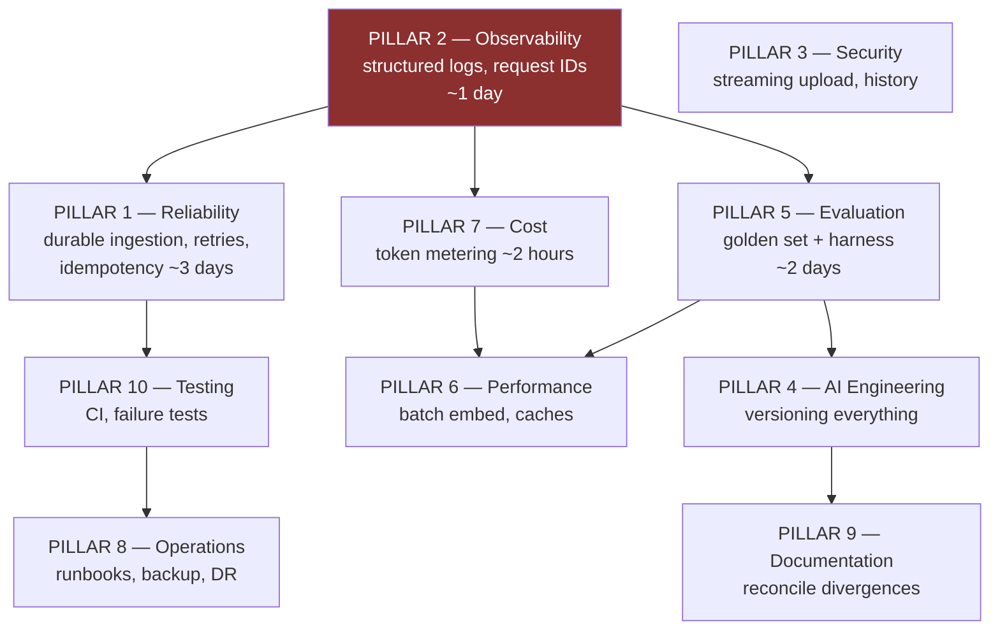

# CampusBrain AI — Production Design Review

**Reviewer:** Staff Engineer, production design review
**Date:** 30 July 2026 · **Branch:** `fix/counting-answers` (`f7b0668`)
**Scope:** reliability, observability, security, AI engineering, evaluation, performance,
cost, operations, documentation, testing
**Method:** source review against the deployed configuration. Every finding cites a file.
No finding is inferred from `DOCUMENTATION.md`, which is stale in three load-bearing places.

---

## 0. Verdict

**Not production ready — but the gap is smaller and differently shaped than a generic
checklist would tell you.**

The precise statement, and the one to use in an interview:

> *"It's a correctly deployed demo with one genuine data-loss path, one memory failure
> that has already happened once, and no way to debug either. What it is not is
> under-engineered — the retrieval layer is better reasoned than most production systems I
> have read. The gap is entirely in the operational envelope around it."*

Three things must be true before "production ready" is an honest phrase, and none of them
is about features:

1. **A document upload cannot silently vanish.** Today it can, and the deployment target
   guarantees the conditions for it.
2. **A wrong answer from yesterday can be reconstructed.** Today it cannot — there are two
   `print()` statements in the entire codebase and neither is on the chat path.
3. **A quality change can be measured.** Today it cannot, which is why seven separate
   tuning decisions are blocked.

Everything else on the ten-pillar list is real work, and none of it matters until these
three are done.

### Correcting the premise

The brief lists the current stack as including **Redis**. It does not. Exhaustive search
finds Redis only in three historical comments recording its *removal*
(`document_processing_service.py:96`, `documents.py:55`, `rate_limit.py:54`). It is not in
`requirements.txt` and not in the Render deployment.

This matters because a reliability plan built on "we have Redis" would assume a durable
queue, a shared rate-limit store and a cache that do not exist. **Every recommendation in
this review assumes no Redis, and says explicitly where one would be the correct answer.**

Corrected stack:

| Layer | Reality |
|---|---|
| Frontend | Vercel free — React + Vite |
| Backend | Render free — FastAPI, **one uvicorn worker**, 512 MB RAM, no persistent disk |
| Database | Neon Postgres free |
| Vectors | Qdrant Cloud free (1 GB) |
| Blobs | Supabase S3-compatible free (1 GB) |
| Models | Gemini free tier — `gemini-embedding-001` + `gemini-3.5-flash-lite` |
| Queue | **None.** FastAPI `BackgroundTasks`, in-process |
| Cache | **None** |
| Redis | **None** |

### The binding constraints

These are what any design must survive. They are not hypothetical — two have already
caused incidents recorded in `DEPLOYMENT_JOURNAL.md`.

| Constraint | Evidence | Consequence for design |
|---|---|---|
| **512 MB RAM total** | `DEPLOYMENT_JOURNAL.md:250` — *"Out of memory (used over 512Mi)"* already occurred | No in-memory buffering of uploads. No second worker. No `torch` |
| **Sleeps after 15 min idle** | `DEPLOYMENT_JOURNAL.md:619` — *"sleeps after 15 minutes idle; the next request waits 30–60 s"* | **Any in-process background work can be killed mid-flight** |
| **One worker, deliberately** | `scripts/render-start.sh` — documented: 4 workers OOM-killed a real deploy | No parallelism. One slow request blocks others. In-memory rate limiting is *correct* here |
| **No persistent disk** | `DEPLOYMENT_JOURNAL.md:98` | No local queue file, no SQLite sidecar, no disk cache |
| **No Shell tab on free tier** | `scripts/render-start.sh` comments | Every operation must be a startup script, an endpoint, or a migration |
| **Gemini free quota** | Ch 1 incident: OpenRouter's 50/day cap took the bot down | Quota is a *daily* budget, not a rate. Retries cannot fix it |

The single most important interaction: **the instance sleeps after 15 minutes idle, and
ingestion takes 248 seconds in a background task that runs after the HTTP response has
already been sent.** Nothing keeps the instance awake during that window.

---

## 1. Findings, ranked by what fires first

Ranked by *probability × blast radius on this deployment* — not by generic severity.

### P0-1 — Ingestion has no durability, and re-indexing can destroy data

**Evidence.** `api/v1/documents.py:60` → `background_tasks.add_task(process_document, document.id)`.
`document_processing_service.py:93-124` runs in-process. `:118-122` is a bare
`except Exception` that sets `FAILED`, `print()`s, and swallows.

Two distinct failures:

**(a) The stuck job.** Upload → response returns immediately → 47 sequential embed calls
over ~248 s → instance sleeps, redeploys, or OOMs → the task dies with no `except` ever
running. The document is left at `PROCESSING` **forever**. No reaper, no retry, no timeout,
no alert. The admin sees a spinner that never resolves.

**(b) The destructive re-index.** `document_processing_service.py:47-52` deletes existing
Qdrant points, then existing chunk rows, *then* re-embeds and re-upserts. The ordering is
correct for consistency (chunk ID is the Qdrant point ID, so points must go first). But it
means a crash between the delete and the upsert leaves the document with **zero chunks and
zero vectors** — the old data is gone and the new data was never written. The document
still reads `PROCESSING`. That is silent data loss, not a stuck job.

**Why it is P0:** the trigger is not an edge case. It is Render free tier's documented
normal behaviour, and the job is 4× longer than it needs to be because embedding is
sequential (`document_processing_service.py:69-85`).

---

### P0-2 — A 100 MB upload is read into a 512 MB box before the size check

**Evidence.** `api/v1/documents.py:42` → `content = await file.read()`. The size check is
at `document_service.py:26`, which runs *after*.

`MAX_UPLOAD_SIZE_BYTES` is 100 MB. The check that enforces it cannot run until the entire
body is resident. Then `magic.from_buffer(content)` holds it, `storage.put_object` holds
it, and `extract()` builds a second representation. Peak is a multiple of the file size, on
a box with 512 MB and a single worker that also has PaddlePaddle loaded.

**Blast radius:** OOM kills the *only* worker. Chat goes down for every tenant. This is not
speculative — `DEPLOYMENT_JOURNAL.md:250` records an OOM on this instance already.

**Aggravating:** `/documents` has no rate limit at all (only `/chat` at 120/min and
`/auth/login` at 5/min). An authenticated admin can issue concurrent uploads.

---

### P0-3 — The API upload path cannot detect duplicates, and duplicates corrupt answers

**Evidence.** `documents.content_hash` exists (migration `9a1c4e7b2d18`) with a composite
index on `(org_id, content_hash)`. It is populated **only** by `tools/ingest.py`. The HTTP
upload path leaves it `NULL` — `document_service.py:53-64`.

Upload the same file twice: two `Document` rows, two full sets of chunks, two full sets of
vectors, double the embedding spend.

**Why this is a correctness bug and not just waste.** Your prompt contains this clause:

```
"The same person or item often appears in several of the numbered
documents; count each one ONCE, no matter how many documents mention it."
```

That clause exists because duplicate content inflates counts. The ingestion path can
*manufacture* the exact condition the prompt is compensating for — and it does so silently.
You fixed the symptom in a non-deterministic component while leaving the deterministic
component free to create the cause.

---

### P1-4 — Nothing on the chat path is observable

Two `print()` calls exist in the entire codebase (`document_processing_service.py:122`,
`storage.py:48`). The chat path emits nothing.

Six questions you cannot answer about any answer ever produced: what was asked, which
chunks were retrieved, what prompt was sent, which model version answered, whether the
relevance guardrail fired, how long it took.

**Second-order cost:** the request log is also the only realistic source of golden-set
questions (Pillar 5). Not logging blocks evaluation as well as debugging.

---

### P1-5 — No retries on any model call

`embeddings/gemini_provider.py:36` and `llm/gemini_provider.py` both do a single
`httpx.post` with no retry, no backoff, no jitter. A single transient 503 during a 47-chunk
ingest fails the entire document.

The irony worth noting: `openrouter_provider.py` **has** a retry loop with exponential
backoff — and it is the dead code path. The live providers have none.

Also: **`httpx` is not pinned in `requirements.txt`.** It arrives transitively. A
transitive major version bump can change timeout or exception semantics under you.

---

### P1-6 — Cost and token usage are unmeasured

Gemini returns `usageMetadata` on every call. Nothing reads it. Cost per answer is unknown,
not small — *unknown*. Every optimisation in Pillar 7 is guesswork until this exists, and
it is roughly six lines.

---

### P1-7 — No evaluation of any kind

No golden set, no retrieval metrics, no faithfulness check, no regression gate, no CI.
Confirmed by exhaustive search. Seven tuning decisions are blocked on this
(`CHUNK_SIZE`, `COMMON_TERM_RATIO`, `RELEVANCE_THRESHOLD`, `RRF_K`, over-fetch, query
condensation, and re-testing the reranker rejection).

`RELEVANCE_THRESHOLD = 0.35` deserves specific mention: it is the binary switch between
"I don't know" and a confident fabrication, it has no comment, no reference, and no
validation. It is the highest-stakes unvalidated constant in the system.

---

### P2 — Latent: correct today, breaks on a specific change

| # | Finding | Correct today because | Breaks when |
|---|---|---|---|
| P2-8 | In-memory rate limiter (`core/rate_limit.py`) | Render runs `--workers 1`, documented and deliberate | `docker-compose.prod.yml:54` uses `--workers 4`. 120/min silently becomes 480/min |
| P2-9 | `ensure_collection` deletes the collection on dimension mismatch (`vector_store.py:49-56`) | Nobody has changed `EMBEDDING_DIM` | Anyone does. A *read* path destroys an org's index. The function name promises idempotence |
| P2-10 | Per-page chunking (`recursive_chunker.py`) | Corpus is Markdown; `page_number` is 1 throughout | The first real PDF. A fact spanning a page break becomes unreachable |
| P2-11 | Client-supplied history is never sanitised | Nobody has abused it | A caller fabricates an `assistant` turn. `sanitize_context()` only covers retrieved chunks, not history |
| P2-12 | `/search` and `/documents` have no rate limit | Both require credentials | A leaked admin token; or `/search` used as an embedding-cost amplifier |

### P3 — Accepted risk, correct for this context

| Finding | Why it is acceptable | The condition that changes it |
|---|---|---|
| Chat endpoint is fully public; org slug is not an auth boundary | The corpus is public college information. A public website has the same property | **Any non-public document is ingested.** Nothing at upload checks this — that is the real gap, and the fix is classification at upload, not authentication |
| No PII detection | Corpus was curated by hand to exclude student PII (`resources/sitarefoundation.md` documents the exclusions) | Any un-curated upload. The control is a human process with no enforcement |
| No reranker | `[MEASURED & REJECTED]` — decision D6, with three named revisit triggers | Documented. This is the one gap that is a strength |

---

## 2. Pillar scorecard

Grades are against *"could you defend this in a design review"*, not against a FAANG bar.

| # | Pillar | Grade | One-line state |
|---|---|---|---|
| 1 | **Reliability** | **D** | No durable queue, no retries, no idempotency, a destructive re-index path, and a deployment target that sleeps mid-job |
| 2 | **Observability** | **F** | Two `print()` statements. Nothing on the request path. Cannot reconstruct any answer |
| 3 | **Security** | **C+** | Genuinely thoughtful in places — constant-time key compare, verified-key rate-limit bucketing, MIME/extension pair validation, admin-only upload. Undermined by the unbounded read and unsanitised history |
| 4 | **AI Engineering** | **B** | The strongest pillar. Hybrid retrieval with a hand-rolled IDF filter, RRF, a pre-generation relevance floor, citation validation. Missing every kind of versioning |
| 5 | **Evaluation** | **F** | Does not exist. Blocks seven other decisions |
| 6 | **Performance** | **D** | 248 s to ingest 35 KB, sequential by interface design. No caching anywhere. N+1 on citation hydration (`chat.py:52-64`) |
| 7 | **Cost Engineering** | **F** | Unmeasured. The meter is handed to you on every response and never read |
| 8 | **Operations** | **D-** | No runbooks, no backup strategy, no CI, no alerting. `DEPLOYMENT_JOURNAL.md` is excellent *forensics* and is not a runbook |
| 9 | **Documentation** | **C** | Volume is exceptional. Accuracy is the problem — three load-bearing claims contradict the code |
| 10 | **Testing** | **C-** | 48 real tests, some genuinely subtle. The entire extraction path is untestable *by construction* (`conftest.py` stubs raise). No CI, so nothing runs them |

**Weighted read:** the pillars where you are strongest (4) are the ones that are hardest to
fake and best to interview on. The pillars where you are weakest (1, 2, 5, 7) are the ones
that are cheapest to fix and most legible as "production engineering". That is an unusually
favourable position — the remaining work is high-value and low-cost.

---

## 3. Execution order

Not the order in the brief. This order is chosen so each step **unblocks** the next.



**Observability is first and it is not negotiable.** Every other pillar needs it as an
input: reliability needs to know what failed, evaluation needs real questions from request
logs, cost needs a place to put the token counts, performance needs stage timings to know
what to optimise. Building it first is what makes the rest measurable rather than
speculative.

| Order | Pillar | Effort | Why here |
|---|---|---|---|
| 1 | **Observability** | ~1 day | Unblocks everything. 20 lines gets you 80% |
| 2 | **Reliability** | ~3 days | The two P0s. Data loss is the only unrecoverable class of bug |
| 3 | **Cost** | ~2 hours | Six lines, and it makes Pillar 6 measurable |
| 4 | **Evaluation** | ~2 days | Unblocks 7 tuning decisions and validates `0.35` |
| 5 | **Performance** | ~2 days | Now measurable. Batch embedding is a 25× win |
| 6 | **Security** | ~1 day | Streaming upload closes P0-2; history sanitisation closes P2-11 |
| 7 | **Testing** | ~2 days | CI, plus failure-injection for what Pillar 1 built |
| 8 | **Operations** | ~2 days | Runbooks are only writable once 1–7 exist |
| 9 | **AI Engineering** | ~1 day | Versioning is cheap and makes every measurement attributable |
| 10 | **Documentation** | ~1 day | Reconcile last, so it documents the finished state |

---

## 4. Pillar 1 preview — the free-infrastructure answer

Stated here so the approach is clear before we start. Full 18-section treatment comes next
session.

**The problem:** durable background work with no Redis, no persistent disk, and a web
process that sleeps.

**The wrong answers, and why:** Celery/RQ/arq need Redis. Kafka is absurd at this volume.
A second Render service is another 512 MB box that also sleeps. A local file queue needs a
disk you do not have.

**The right answer: Postgres is the queue.** You already run it, it is already durable, it
already has transactions, and `SELECT … FOR UPDATE SKIP LOCKED` is a correct,
battle-tested job-claiming primitive.

| Mechanism | Implementation | Solves |
|---|---|---|
| **Durable job rows** | A `jobs` table with `status`, `attempts`, `claimed_at`, `last_error` | P0-1(a): the job survives a process death because it was never *in* the process |
| **Claim with a lease** | `FOR UPDATE SKIP LOCKED` + `claimed_at` timestamp | Two workers cannot take the same job; a dead worker's lease expires |
| **Reaper** | On startup, and periodically: reset jobs whose lease expired | The stuck-`PROCESSING` document self-heals |
| **Retry classification** | Retry 5xx/timeouts with backoff **and jitter**; never retry 4xx or a daily quota | P1-5 — and it is the Ch 1 lesson, encoded |
| **Dead-letter** | `attempts >= 3` → `status = 'dead'`, surfaced on an admin endpoint | Failures become visible instead of silent |
| **Resumable ingestion** | Persist chunks first, embed in batches, record `embedded_at` per chunk | P0-1(b): a crash resumes from chunk 40, and never deletes before it can replace |
| **Idempotency** | Content-hash on the API path; unique index on `(org_id, content_hash)` | P0-3 |
| **Keeping the instance awake** | A free external cron (cron-job.org / GitHub Actions) pinging `/health` every 10 min | Turns "sleeps mid-job" from a certainty into an exception |

Every one of those is free, and every one is the same *principle* a large company
implements with heavier machinery. That is exactly the framing the brief asks for: not
"we couldn't afford Kafka", but **"Postgres `SKIP LOCKED` is the correct tool at this
volume, and here is the throughput at which I would outgrow it."**

---

## 5. One process note

The brief says *"Never skip any section"* of the 18. I will honour the structure, with one
amendment: where a section genuinely does not apply, it will say **"N/A — because X"** in
one line rather than being padded.

A tracing section that invents a distributed trace for a single-process app teaches you a
fiction, and an interviewer will find the seam. *"No distributed tracing, because there is
one process — stage timings in a structured log carry the same information at this
topology, and here is the traffic level at which that stops being true"* is a better answer
and a shorter one.
